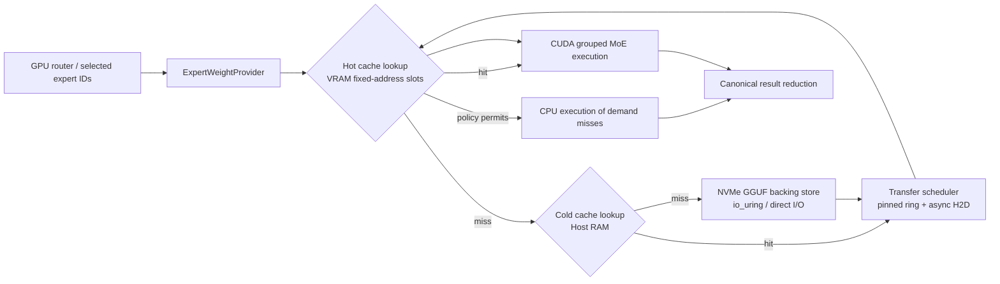
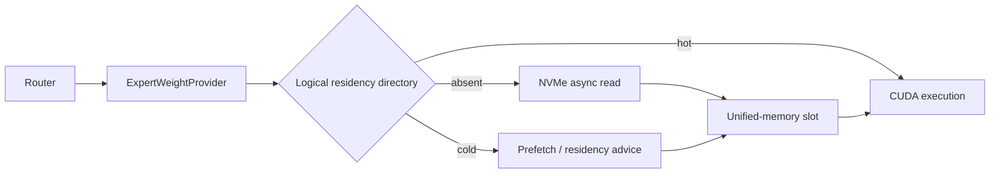

# K3 Out-of-Core

A research and engineering project to run the text portion of **Kimi-K3** when the routed-expert weights are much larger than available accelerator memory and, ultimately, much larger than host memory.

This repository is the **source of truth** for architecture, decisions, validation evidence, implementation planning, and handoff between ChatGPT and Codex sessions.

> Project status: architecture and implementation plan defined; tiny K3 checkpoints downloaded; the `llama.cpp` K3 model-support branch is under validation. No out-of-core runtime code has been implemented yet.

## Goal

Build a production-quality out-of-core MoE runtime for Kimi-K3 on top of `llama.cpp`/GGML that:

1. keeps the non-routed part of the model resident;
2. stores routed experts on NVMe;
3. maintains an explicit cold cache in host memory;
4. maintains an explicit hot cache in accelerator-visible memory;
5. moves, executes, and evicts experts asynchronously according to actual routing;
6. supports both discrete GPUs and coherent unified-memory systems such as NVIDIA DGX Spark;
7. preserves numerical correctness relative to a monolithic GGUF baseline;
8. makes cache, I/O, transfer, and scheduling behavior observable and testable;
9. scales from the tiny 0.40B K3 fixtures to the full K3 expert layout without redesign.

The final objective is not merely to make a model load. It is to deliver a controlled runtime whose latency, bandwidth use, cache behavior, and correctness can be explained and reproduced.

## Motivation

Kimi-K3 is a sparse Mixture-of-Experts model. Only a subset of routed experts is selected for each token, but conventional runtimes still assume that the complete expert tensors are resident in RAM or accelerator memory.

That assumption breaks down for the full checkpoint. Sparse activation creates an opportunity:

- dense, attention, routing, shared-expert, and recurrent state can remain resident;
- only selected routed experts need to become executable for a given layer and token;
- routing exhibits temporal and workload-dependent reuse that can be exploited by an explicit cache;
- NVMe capacity is inexpensive compared with hundreds of gigabytes or terabytes of DRAM/VRAM.

A naïve implementation can easily be slower than CPU inference because every miss becomes a synchronous transfer. The project therefore treats **expert residency, transfer, miss execution, and prefetch as first-class runtime concerns**, not as page-cache side effects.

## Scope

### In scope

- Kimi-K3 text inference in `llama.cpp`.
- MXFP4 routed experts.
- CPU reference execution and CUDA execution.
- Explicit three-tier storage hierarchy:
  - NVMe backing store;
  - cold host-memory cache;
  - hot accelerator cache.
- Coherent UMA mode where hot and cold are logical states over one physical memory pool.
- Persistent fixed-address expert slots.
- Runtime mapping from global expert IDs to cache slots.
- Asynchronous NVMe reads, host staging, and CUDA transfers.
- Pluggable admission, eviction, and prefetch policies.
- Discrete-GPU miss policies, including optional CPU execution of demand misses.
- Correctness, trace capture, replay, simulation, and performance telemetry.
- Single-request implementation first, followed by multi-request and multi-GPU correctness.
- Selective reuse of prior work in `llama.cpp`, vLLM, tinyserve, the Lidenburg fork, and MoE-Infinity.

### Explicitly out of scope for the initial implementation

- Kimi-K3 vision support.
- Training or fine-tuning.
- Changing Kimi-K3 routing semantics.
- Approximate experts, expert dropping, or quality-reducing substitutions.
- A new expert-file format before GGUF-backed I/O is measured and shown insufficient.
- Depending on Linux page-cache eviction as the final cache controller.
- Treating graph-temporary staging tensors as persistent cache storage.
- A monolithic patch that mixes storage, cache policy, I/O, CUDA kernels, CLI, and model support without separable interfaces and tests.
- Silent fallback when a requested configuration cannot satisfy correctness or capacity constraints.

## Architecture

### Discrete GPU



Physical hierarchy:

```text
Tier 0  NVMe GGUF backing store
Tier 1  Cold cache in host RAM
Tier 2  Hot cache in VRAM
```

The initial discrete-GPU design is **inclusive**: an expert promoted to VRAM normally retains a host-memory copy. This makes hot eviction cheap and avoids GPU-to-host writeback. The large cold cache uses ordinary aligned host memory; only a bounded transfer ring is pinned/registered.

### Coherent UMA



On systems such as DGX Spark, hot and cold remain useful policy states, but they do not require duplicate physical copies. Promotion becomes residency preparation and synchronization rather than PCIe H2D copying.

### Logical components

```text
ExpertWeightProvider
├── ResidentExpertProvider
├── CachedDiscreteCudaProvider
├── CachedUmaProvider
└── CpuExpertProvider

Cached provider
├── ExpertDirectory
├── HotExpertCache
├── ColdExpertCache
├── ExpertStorage
├── ExpertScheduler
├── ExpertTransport
├── CachePolicy
└── Telemetry
```

The inference graph requests executable expert weights through the provider. Kernels do not own cache policy or storage logic.

### Expert identity and slots

The logical cache unit is an entire routed expert:

```text
ExpertKey(layer, expert_id)
ExpertBundle = gate/up/down routed-expert weights and required quantization metadata
```

The three physical tensors may remain separate GGUF spans and device buffers, but admission, pinning, eviction, and lifetime are atomic at `ExpertBundle` granularity.

Hot slots are persistent and fixed-address. Graph allocators must never own them. A persistent directory maps:

```text
(layer, global_expert_id) -> slot_id or MISS
```

Selected IDs are remapped to slot IDs before the MoE kernel indexes the hot cache.

### Miss handling

A cache miss is not automatically forced onto the synchronous H2D critical path.

The runtime must support:

```text
PROMOTE_AND_GPU  load/promote, then execute on GPU
CPU_FALLBACK     execute the demand miss on CPU while optionally promoting in background
AUTO             choose from measured transfer and compute costs
```

`AUTO` is intentionally undecided until measurements exist. UMA is expected to prefer GPU execution; discrete GPUs may benefit from hit-on-GPU/miss-on-CPU overlap.

### I/O and transfer

The endpoint design uses explicit asynchronous I/O:

```text
NVMe -> bounded aligned transfer buffers -> cold slots and/or hot slots -> CUDA
```

Requirements:

- explicit file offsets from the GGUF loader;
- no `/proc/self/maps` reverse lookup;
- bounded in-flight reads and memory;
- demand requests outrank prefetch;
- cancellation or demotion of speculative work;
- double or multi-buffered transfers;
- separate completion events for disk, host population, H2D, and compute readiness;
- buffered-I/O fallback when direct I/O is unsupported, without changing cache semantics.

### Cache policies

The mechanism must not hard-code one policy. At minimum, the evaluation set includes:

- LRU as a deterministic test baseline;
- LFRU;
- SLRU with protected/probationary segments;
- optional frequency-gated admission;
- LFU with aging.

The production default is **open** and will be selected from real K3 routing traces. Prefill and decode must be measured separately because prefill can pollute a decode-optimized cache.

### Prefetch

Prefetch is subordinate to demand correctness and latency. Candidate predictors include:

- same-expert temporal reuse across tokens;
- per-layer transition history;
- cross-layer routing prediction;
- static/imatrix-derived hot-set seeding;
- trace-trained policies.

No N+1 predictor is assumed effective until K3 traces demonstrate useful precision and lead time.

## Core design principles

1. **Correctness before throughput.** Every phase is compared with a monolithic model.
2. **Persistent ownership.** Cache memory survives graph compute epochs and is never inferred from pointer stability.
3. **Fixed addresses.** Hot slots are allocated once where possible to remain compatible with CUDA graphs.
4. **Backend independence.** Routing and cache policy do not depend on CUDA, UMA, or a particular I/O mechanism.
5. **Explicit state.** Every expert is absent, loading, cold-ready, promoting, hot-ready, pinned, or evicting.
6. **Bounded resources.** No unbounded pinned memory, I/O queue, speculative prefetch, or hidden page-cache dependency.
7. **Deterministic reduction.** Asynchronous completion order must not alter top-k result reduction order.
8. **Evidence-driven policy.** Cache and prefetch defaults are chosen from traces and benchmarks, not intuition.
9. **Small integration surfaces.** `ggml-backend.cpp` should expose hooks, not contain the full implementation.
10. **No premature file-format fork.** Use GGUF as backing store until measurements justify an expert-specific format.

## Current baseline

As of **2026-07-29**:

- Upstream K3 text support is under review in `ggml-org/llama.cpp#26185`.
- Current upstream PR head observed while creating this repository: `cf67f0d24511864d2d3da0769108fd6fc16d00d1`.
- Local development models:
  - `inference-optimization/Kimi-K3-0.40B`;
  - `inference-optimization/Kimi-K3-0.40B-MXFP4`.
- The tiny model preserves KDA/MLA, latent MoE, residual paths, eight experts, and top-2 routing.
- Local MXFP4 inspection observed 203 packed tensors:
  - 168 per-expert routed tensors;
  - 35 additional resident MoE tensors.
- Conversion workarounds have been identified but end-to-end GGUF conversion and inference have not yet been recorded as completed.

See [Models and validation](docs/MODELS_AND_VALIDATION.md) and [Current status](docs/STATUS.md).

## Repository map

- [`PLAN.md`](PLAN.md) — detailed implementation sequence and exit gates.
- [`AGENTS.md`](AGENTS.md) — operating instructions for Codex and other coding agents.
- [`docs/DECISIONS.md`](docs/DECISIONS.md) — accepted decisions, rejected shortcuts, and open questions.
- [`docs/PRIOR_ART.md`](docs/PRIOR_ART.md) — related work and exact reuse plan.
- [`docs/MODELS_AND_VALIDATION.md`](docs/MODELS_AND_VALIDATION.md) — checkpoints, conversion, hardware, tests, and benchmark matrix.
- [`docs/STATUS.md`](docs/STATUS.md) — dated handoff state for new sessions.

## Source-of-truth rules

1. Accepted architectural choices live in `docs/DECISIONS.md`.
2. Work sequencing and gates live in `PLAN.md`.
3. Reproducible model commands and evidence live in `docs/MODELS_AND_VALIDATION.md`.
4. The latest session handoff lives in `docs/STATUS.md`.
5. A chat conclusion is not authoritative until the relevant file is updated and committed.
6. Speculation must be marked **OPEN** or **SPECULATIVE**; it must not silently become an implementation requirement.

## License

No license has been selected yet. Do not copy third-party code into this repository until its license and attribution requirements have been reviewed.
