# Cache-Aware Expert Routing: Trading Routing Slack for Memory Locality in Kimi K3 Inference

# Abstract

Mixture-of-Experts (MoE) models reduce active computation by routing each token to a small subset of experts, but their full expert pool can remain too large for memory-constrained inference. Moving experts to secondary storage allows the expert pool to exceed memory capacity, but turns routing decisions into physical storage demand. We study this problem on full Kimi K3 with bounded in-memory expert residency backed by a local NVMe SSD, and introduce deterministic, training-free cache-aware substitutions drawn from a bounded candidate set, with at most two swaps and a hard per-swap router-score regret limit. In a non-random 24-prompt matched comparison subset drawn from a frozen 128-prompt corpus, the selected two-swap policy (`S2_P50`) achieves higher measured decode TPS than both exact routing (`EXACT`) and a tighter one-swap comparator (`KNEE`) in all 24 prompts. Within the same measured domain, a post-hoc leave-one-family-out analysis finds backing expert loads per token to be a strong predictor of physical decode throughput (R² = 0.993536), linking routing locality to systems performance. The gain is not quality-neutral: under controlled fixed-context evaluation, S2_P50 increases reference-token NLL by 0.012030 on average, while free-generation experiments show a mean 1.4210× amplification of the measured perturbation through token-mediated autoregressive feedback. These results establish a K3-specific performance–memory-locality–quality trade-off. Task-level accuracy preservation and cross-model generality remain outside the current evidence.

---

# 1. Introduction

Mixture-of-Experts (MoE) models decouple total parameter capacity from the amount of expert computation used for one token: a router activates only a small subset of experts at each routed layer. That sparsity, however, does not remove the need to make the complete expert pool serviceable. On a memory-constrained machine, placing experts outside fast memory solves the capacity problem only by creating a second one: every selected expert that is not already available in a fast tier must be serviced from a slower tier.

Kimi K3 makes this tension concrete. Its 92 routed layers each expose 896 routed experts and select the top 16. In the accepted MXFP4 runtime, one `(layer, expert)` bundle occupies 17,547,264 bytes. A generated token therefore produces 1,472 routed expert selections, corresponding to 25,829,572,608 bytes (about 25.83 GB) of selected expert payload before reuse or cache hits. This quantity is neither a resident-memory requirement nor measured storage traffic. It is the cumulative service-demand scale presented by exact routing. We use *out-of-core inference* in the standard systems sense: the full expert pool exceeds the selected fast-memory budget, so selected experts can be serviced from a lower storage tier. Our measured configuration uses a local NVMe SSD for that tier.

A straightforward out-of-core path can leave the expert pool file-backed in secondary storage and service exact router selections on demand, for example through mapped or direct file access. This already decouples model capacity from fast-memory capacity, but it does not remove the cost of servicing selected experts. Several systems reduce that cost with explicit expert caching, prefetching, placement, or heterogeneous execution. A second control surface is to make routing itself locality-aware so that the requested working set better matches current residency. MoE-Infinity, WASTE, Colibrì, and FreeToken explore variants of the first control surface under different memory hierarchies and representations. Our K3 measurements motivate studying the second without treating expert caching as a prerequisite of out-of-core serving.

The router offers that second control surface. K3 selects 16 experts from a much larger ranked set, and experts just outside the exact top-16 can be near-ties in the corrected K3 selection score. Cache-Conditional Experts and MoE-ERAS already make residency part of expert selection, while ReMoE fine-tunes the router to increase temporal reuse. We do not claim to invent cache-aware routing. Instead, we evaluate a fixed, deterministic, training-free K3-specific policy that considers only the top 32 candidates, changes at most two selected experts per routed layer, accepts a substitution only under a fixed hard per-swap selection-score regret bound, and preserves the model's original expert-weighting semantics after membership is chosen.

We integrate this bounded substitution rule with a full-K3 runtime that owns bounded expert residency and exposes physical hits, misses, backing loads, and bytes. Exact routing remains the reference path. In the primary full-prompt protocol, K3 consumes the prompt under exact routing, preserves the resulting cache state, and enables the changed policy only for decode. A resident near-tie candidate can then replace a nonresident exact selection only when every hard bound passes. The mechanism spends bounded routing slack rather than additional measured cache capacity. It does not assume that a local router-score bound is a semantic-safety guarantee.

These observations motivate the evaluation that follows. We ask whether bounded residency-aware substitutions reduce physical expert-service demand at a fixed cache capacity, whether any systems effect persists across the frozen workload corpus, and what predictive perturbation appears under controlled fixed-context and free-generation evaluation. The paper answers those questions while keeping task-level accuracy preservation and cross-model generality outside the current evidence.

This paper makes four contributions:

1. **A full-K3 runtime and physical-service measurement substrate with bounded expert residency.** We make expert residency and backing service observable for Kimi K3, providing a controlled basis for relating routing demand to physical execution rather than relying on implicit cache behavior.
2. **A cross-workload characterization of K3 expert locality.** Across the frozen 128-prompt corpus, we measure workload-conditioned routing/locality and physical performance, and use these frozen measurements for a post-hoc leave-one-family-out analysis connecting backing expert loads per token to decode TPS within the measured domain.
3. **Deterministic bounded cache-aware routing on K3.** We use contemporaneous residency to substitute at most two experts from a top-32 candidate set under a hard corrected router-score regret bound, without training or changing the model's expert-weighting semantics.
4. **A long-horizon quality and feedback characterization.** Controlled fixed-context and free-generation experiments measure predictive drift, token-mediated autoregressive amplification, and the limited predictive value of simple accumulated-regret summaries.

---

# 2. Background and Motivation

## 2.1 Sparse MoE inference and Kimi K3

A routed Mixture-of-Experts layer contains many expert feed-forward networks but evaluates only a small router-selected subset for each token. This sparsity reduces the amount of expert computation performed by one token; it does not remove the requirement that the serving system be able to supply any expert the router may select. Kimi K3 makes this distinction concrete: 92 layers contain routed MoE blocks, each with 896 routed experts, while exact inference selects the top 16 experts at each routed layer. One generated token therefore produces 1,472 layer-expert selections across the routed stack.

For storage and cache management, we treat one `(layer, expert_id)` as a logical `ExpertKey` and the routed gate/up/down weights plus their required quantization metadata as one `ExpertBundle`. In the accepted K3 runtime, an ExpertBundle occupies 17,547,264 bytes. `ExpertBundle` is a systems service unit used by this paper; it does not change the model's MoE computation.

Expert membership and expert weighting are separate semantics. Exact K3 first chooses the top-16 membership, then applies the model's original expert weights and normalization to that selected set. The mechanism introduced later may change a bounded number of selected IDs, but it leaves that weighting rule unchanged. This distinction lets us separate a systems change in which bundles are requested from the model semantics used to combine the selected experts.

## 2.2 The memory mismatch

K3 activates only `16/896 ≈ 1.8%` of the routed experts in any one layer, which makes sparse execution attractive on hardware that cannot keep the complete expert pool in fast memory. The active path is nevertheless large as a memory-service workload. Across 92 routed layers, one token selects 1,472 ExpertBundles; summing their bundle sizes gives 25,829,572,608 bytes (about 25.83 GB) of selected expert payload before any reuse or cache hits are considered.

| Quantity | Kimi K3 value | Meaning |
|---|---:|---|
| Routed experts/layer | 896 | Total routed choice set in each routed layer |
| Selected experts/layer | 16 | Exact active membership for one token |
| Routed layers | 92 | Routed decisions traversed by one token |
| Expert bundle | 17,547,264 B | Storage/cache service unit for one layer-expert pair |
| Selected bundles/token | 1,472 | Cumulative top-16 selections across the routed stack |
| Selected payload/token | 25,829,572,608 B | Sum of selected bundle payload before reuse/cache hits |

The last row is a **service-demand scale**, not a resident-memory requirement and not measured backing-store traffic. A resident bundle can satisfy a selection without a backing load, and repeated use can amortize its storage cost across many tokens. The memory mismatch is therefore not simply “model size versus RAM”: sparse activation makes out-of-core execution possible, while temporal reuse and cache locality determine how much of the selected demand must actually cross a slower memory boundary.

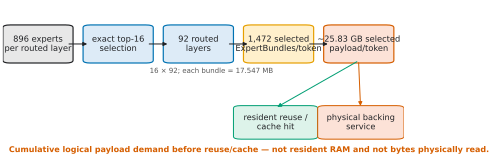

**Figure 1 — K3 selected-payload service-demand funnel.** The committed K3 model constants imply 16 selected experts across each of 92 routed layers, or 1,472 selected ExpertBundles per generated token. At 17,547,264 bytes per bundle, that is about 25.83 GB/token of cumulative logical selected payload before reuse or cache hits. It is neither simultaneously resident RAM nor measured physical backing traffic; each selection is subsequently resolved by resident reuse/cache service or by physical backing service. This is an explanatory derivation from model/runtime constants, not an empirical performance result.

## 2.3 Why exact expert offloading does not remove expert service

Offloading decouples model capacity from fast-memory capacity. The simplest out-of-core path can keep routed expert weights file-backed in secondary storage and service exact selections on demand. More optimized systems can add explicit managed residency or expert caches so that frequently reused experts avoid repeated lower-tier service. Regardless of whether such a cache exists, once the router has made an exact selection each selected ExpertKey must either already be executable from a faster tier or be serviced from a lower tier:

```text
exact router selection
   -> expert availability / service lookup
      -> fast-tier or resident: execute expert
      -> lower-tier: service selected expert -> execute
```

Prior systems reduce the cost of this exact-selection path in complementary ways. MoE-Infinity uses activation-aware caching and prefetching. WASTE and Colibrì stream router-selected K3 experts from secondary storage. FreeToken serves exact selections from a host-RAM expert pool through VRAM caching and heterogeneous miss execution. These techniques improve where, when, or how exact router-selected experts are materialized or executed. They do not, by themselves, reduce the set of experts requested by exact routing.

The remaining cost is the demand presented to that service path. If an exactly selected ExpertBundle is not already available in a fast tier, it must still be fetched or executed from a lower tier. A larger explicit cache can reduce such service, but only by spending more of the scarce RAM or VRAM that motivated offloading. Faster backing I/O and prefetch can reduce or hide lower-tier latency, but do not make the selected demand disappear. OS page cache may assist file-backed implementations, but this paper uses explicit managed residency because implicit page-cache state is not a sufficiently controlled policy for reproducible physical measurements. We do not assume that explicit expert caching is universal or required by other offloading systems.

Thus exact offloading solves a capacity problem without, by itself, eliminating the expert-service problem. Exact-routing execution techniques remain complementary. The remaining question is whether locality can also be improved by reducing the demand presented to the service path rather than only by serving exact selections faster or allocating more cache. Section 3 first characterizes K3's exact demand and routing slack before the routing mechanism is introduced.

## 2.4 How the investigation narrowed the problem

We did not begin by changing K3 routing. The first question was whether exact expert service could be made explicit and cheap enough that routing demand no longer mattered. Earlier physical work established a real secondary-storage endpoint and made provider, residency, and backing behavior observable. Subsequent exact-service profiling found concrete feed-path costs—including duplicated residency work, staging/copy overhead, and exposed completion barriers—and later full-model attribution still placed provider/storage service over a large fraction of routed-layer wall time. Those experiments justified batching, issue-ahead, and service-path cleanup, but they changed how exact misses were served, not which experts exact routing requested.

The next question was whether simply retaining more exact-route experts solved the remaining problem. It did not monotonically do so. In one same-protocol capacity study, a 96-GiB managed cache entered a severe reclaim/refault regime while a smaller 64-GiB control remained pressure-free even though it moved more expert bytes per forward. That negative result led to a residency-safe automatic capacity rule: cache capacity had to be treated as a constrained systems resource rather than a free locality knob.

Only then did we ask whether the demand itself could move at fixed safe capacity. This sequence separates two complementary levers: first optimize the cost of servicing exact selections; then, once the memory and service limits are measured, use bounded router near-ties to avoid some expensive selections. The historical campaigns above use different hosts, capacities, and protocols, so their absolute throughput values are not combined. Their role here is methodological: each result closed one explanation or exposed the next question.

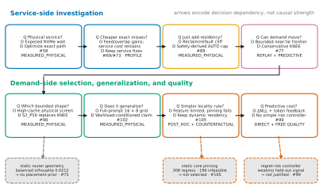

**Figure 2 — Research decision map (mixed evidence classes labeled per node).** Arrows encode decision dependency rather than causal strength or numerical comparability. The service-side sequence made physical expert service observable, improved exact miss service, and exposed the memory-pressure limit of simply increasing residency. The demand-side sequence then moved from bounded near-tie replay and the conservative KNEE decision to the protocol-distinct physical S2_P50 selection, full-prompt cross-workload validation, tests of simpler locality policies, and controlled long-horizon quality/feedback. Dashed branches retain negative results rather than hiding them. No cross-phase throughput values share an axis.

---

# 3. Characterizing Out-of-Core K3

Out-of-core K3 is not a uniform stream of expert reads. The number of experts activated per layer is fixed, but which ExpertKeys are requested, how often they are reused, and how many of those requests fall outside the resident set depend on the workload and cache state. We therefore characterize the problem in four steps: how expert demand varies across workloads, whether physical backing service explains decode performance, how far exact caching can address that demand by itself, and whether the router exposes a bounded amount of local flexibility that could be used without simply allocating more memory.

## 3.1 K3 expert demand is workload-dependent

The frozen cross-workload corpus contains 128 deliberately diverse prompts arranged as 16 semantic families × 8 ordered within-family length levels; actual templated prompt length is retained separately as a quantitative variable. It is a controlled workload grid, not a random sample of all K3 use. Across that corpus, the frozen cross-workload campaign classifies cross-prompt dispersion as high, the semantic-family effect as strong, and the token-length effect as weak. Repeated sentinels keep deterministic route/locality state fixed while exposing host-level timing noise, so the observed prompt dependence cannot be reduced to process drift alone.

Separate observer captures provide route-level evidence without treating observer timing as performance data. Across 44 frozen captures, the frozen cross-workload campaign finds broad route coverage, and the curated route features show materially different working-set and overlap structure across prompts and families. These observations do not assign semantic functions to individual experts, nor do they imply that one family deterministically selects one expert set. They establish the narrower systems fact we need: the resident working set useful for one workload cannot be assumed to be the useful working set for another.

This distinction matters for static caching. A recurring core may exist, but broad, workload-conditioned peripheral demand remains. The later committee-pin analysis makes the limitation concrete—many static-pinning cells regress or are infeasible—but that result is post-hoc and counterfactual rather than physical production evidence. For the present characterization, the measured and observer evidence is sufficient to reject a workload-independent hot-set assumption.

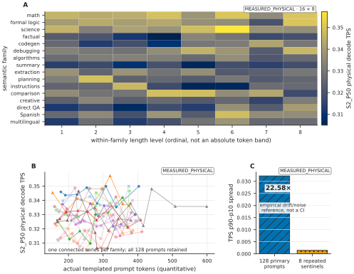

**Figure 3 — Workload-conditioned physical variation (`MEASURED_PHYSICAL`).** Panels A/B retain the complete 16-family × 8-level S2_P50 corpus and actual templated token counts; Panel C compares primary and repeated-sentinel TPS p90–p10 spreads. The 22.58× ratio is a drift/noise reference, not a CI. The corpus is controlled rather than IID; the plot neither assigns expert semantics nor establishes cross-model behavior. Figure A1 gives route detail and Figure A5 the static-pinning limitation.

## 3.2 Physical backing service is tightly associated with measured throughput

The primary cross-workload campaign makes backing service explicit. Physical rows were collected with a fixed 7,849-slot managed cache (137,728,475,136 bytes), fresh processes, a cold managed-cache start, CPU-only execution, native `io_uring` + `O_DIRECT`, and a single local-NVMe expert backing device. The matched 24-prompt comparison subset adds physical EXACT and KNEE runs at that same capacity, alongside the already-frozen S2_P50 rows. The resulting counters distinguish logical expert selections from the ExpertBundles that actually have to be loaded from backing storage.

Using those measured physical rows, the final curated analysis asks a narrower post-hoc question: how well does backing demand predict decode throughput when an entire semantic family is held out? Backing expert loads per token achieves leave-one-family-out R² = 0.993536 for the target **physical decode TPS**. A separate working-set analysis asks a different question and finds that its best single feature reaches LOFO R² = 0.465884 for the target **physical hit ratio**. These R² values are therefore not competing predictors of the same target. The physical rows are `MEASURED_PHYSICAL`; both fitted analyses are `POST_HOC_EXPLORATORY`. We use them as in-domain characterizations, not as hardware-independent laws or causal coefficients.

Within that measured domain, decode performance tracks the number of ExpertBundles the system actually services from backing storage closely. The separate working-set result instead shows that one compact descriptor explains only part of physical hit-ratio variation; because the targets differ, it does not establish a head-to-head ranking of predictors. Arithmetic sparsity fixes how many experts are executed; it does not fix how many expert bundles must cross the slow memory boundary. For out-of-core K3, physical backing demand is therefore the systems quantity that the design must control.

## 3.3 A larger exact cache buys locality with the scarce resource

The obvious response to backing demand is to keep more exact-route experts resident. The physical cross-workload campaign already operates at a fixed high-cache point—7,849 ExpertBundle slots, about 128.27 GiB—so increasing the exact cache would consume more of the memory resource that motivated out-of-core execution in the first place. This makes “add cache” a valid baseline, but not a free solution.

The final curated analysis evaluates that baseline offline using the frozen exact-route capacity curve. These rows are `EXACT_REPLAY` or exact-replay counterfactuals, and the virtual-cache analysis built from them is additionally `POST_HOC_EXPLORATORY`. They answer a counterfactual question: given the frozen route, what exact-cache capacity would be required to reach a target locality? They do **not** measure physical TPS at those hypothetical capacities, and an exact-cache equivalence must not be relabeled as measured RAM savings.

The replay nevertheless establishes the right comparison. Exact routing can trade more memory for fewer backing loads. The question for an out-of-core design is whether comparable locality can instead be obtained at the same measured physical cache capacity by changing a very small number of routing decisions. That distinction—larger exact cache versus bounded demand reduction at fixed capacity—sets up the mechanism evaluated later.

## 3.4 The K3 router exposes bounded local slack

The final ingredient is whether exact top-16 membership is separated sharply from every alternative. Intuitively, *routing slack* is the small loss in corrected K3 selection score incurred when an exact top-16 expert is replaced by a nearby lower-ranked candidate; we refer to that lost score as router selection-score regret. A small gap means that the router expressed only a small local preference for the exact choice, not that the two experts are semantically equivalent.

The short-horizon study captured the exact top-32 K3 candidate ordering and swept observed boundary-score gaps offline before changed routing was used as a systems mechanism. The resulting replay frontier was positive: nearby candidates existed often enough that small, explicitly bounded membership changes could reduce replayed backing demand. This is `FIXED_ROUTE_COUNTERFACTUAL` evidence, not a physical speedup and not a semantic-quality result.

A conservative point illustrates the opportunity without assuming the later policy outcome. At a 96-GiB replay anchor, allowing at most one substitution at the observed p10 score-gap threshold (`0.00129789114`) changed 1.486% of selected slots while reducing replayed expert loads by 4.162%; the p25 threshold (`0.00308857858`) changed 2.747% of selected slots and reduced replayed loads by 6.575%. The same sweep identified the p50 boundary `0.00730375946`. These quantities describe router selection-score slack and replayed locality only. They do not imply semantic equivalence, and the physical effect must be measured on the real generated route stream.

The first runtime decision from that frontier was deliberately conservative. The short-horizon study recommended the top-32, one-swap p25 point that we call KNEE. More aggressive p50 points were retained as diagnostics: the widest stress setting naturally saturated below its hard swap budget and bought only a small locality increment over the max-four point while teacher-forced KL/JS increased materially. Next-token top-1 agreement remained 23/24 at the retained short horizon, but generated outputs and internal trajectories changed, so that observation was not treated as quality neutrality.

That decision did not answer which bounded shape was best once the system later operated at a higher, pressure-safe cache point. A separate physical policy-shape experiment therefore reopened only the already-supported swap/regret envelope, without changing the top-32 candidate boundary or inventing new thresholds. Its preregistered seven-profile screen selected S2_P50, the two-swap p50 point: median TPS was 7.708% higher and measured loads/bytes per token 15.866% lower than KNEE, and three fresh paired confirmations reproduced +6.832%, +6.857%, and +7.110% TPS gains. We therefore carried S2_P50 forward. This is a change in the selected operating point after a different physical question, not retrospective retuning of the original quality evidence.

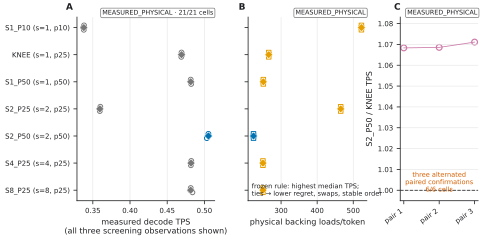

**Figure 4 — Two-stage KNEE → S2_P50 policy evolution.** Panel A keeps #77's `FIXED_ROUTE_COUNTERFACTUAL` 96-GiB free-route locality frontier separate from its short-horizon teacher-forced predictive evidence: KNEE was the conservative one-swap/p25 recommendation, while max16 naturally realized seven swaps and added only 0.683 percentage points beyond max4 as KL/JS rose sharply; 23/24 top-1 agreement is not quality neutrality. Panels B–D are the protocol-distinct #98 `MEASURED_PHYSICAL` screen and all three paired confirmations that selected S2_P50 for the new high-cache operating-point question. Absolute values are never pooled across #77, #98, or the later full-prompt campaign.

Together, the characterization yields four design requirements. The system should (1) reduce physical backing demand without simply increasing cache capacity; (2) preserve ordinary exact routing as the reference and default path; (3) make every intentional membership change deterministic and bounded in candidate rank, swap count, and router selection-score regret; and (4) measure the semantic consequences of those changes rather than inferring safety from a small local score gap. The measurements therefore point to two coupled controls: explicit expert residency, so physical demand is observable and reproducible, and a bounded routing rule that can prefer an already-resident near-tie candidate only under hard approximation limits.

---

# 4. K3 Out-of-Core Design

Section 3 leaves four systems constraints: useful expert residency is workload-dependent, physical backing service is tightly associated with throughput in the evaluated regime, increasing an exact cache spends the scarce memory resource, and routing slack is only actionable if the runtime exposes contemporaneous residency. We address these constraints with an explicit expert-service layer whose managed state is bounded and observable, then expose its residency state to the routing mechanism of §5. The storage hierarchy, persistent expert cache, and provider abstraction follow established expert-offloading designs; we use them as a controlled substrate for full-K3 measurement rather than claim them as new architecture.

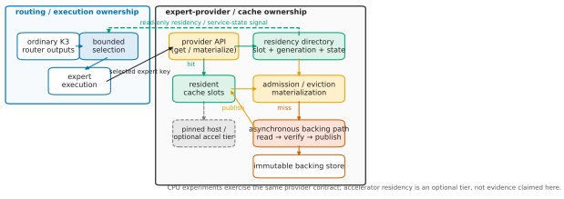

**Figure 5 — Provider-mediated architecture and ownership.** Routing owns K3 outputs, bounded selection, and execution; provider/cache owns residency, slots, admission/eviction/materialization, and verified asynchronous backing. Read-only residency state flows to routing, but cache does not choose experts. The optional accelerator tier is architectural only; primary measurements are CPU-only. Prior-art cache/provider patterns are not claimed as standalone novelty.

## 4.1 Design goals

The runtime follows five design goals. **First, bound managed memory and concurrency.** Expert caches, staging buffers, and in-flight backing requests have explicit capacities, so out-of-core execution cannot recover model capacity by silently creating another unbounded memory pool. **Second, preserve an exact reference path.** When cache-aware routing is disabled, the router selects the ordinary K3 top-16 membership and the runtime must service those experts without changing their model-defined weighting semantics. Storage placement may change when an expert becomes executable, but not which exact expert was requested.

**Third, make residency explicit and reproducible.** Persistent residency is represented by cache-owned state and cache-owned buffers rather than inferred from OS page-cache behavior or graph-temporary allocations. **Fourth, make backing service asynchronous but bounded.** Lower-tier reads and transfers should overlap useful work where the execution regime permits it, while demand requests retain priority over speculative work and queue depth remains controlled. **Finally, expose physical service rather than only logical cache behavior.** Hits, misses, backing loads, backing bytes, wait states, and fallbacks are observable so that routing demand can be connected to the measured throughput association characterized in §3.

## 4.2 Provider-mediated expert service

We place a materialization boundary between the inference graph and expert storage. The graph produces selected expert identities and requests executable weights through an `ExpertWeightProvider`; it does not decide whether those weights come from a resident slot, host cache, accelerator cache, or backing file. The logical identity is an `ExpertKey = (layer, expert_id)`. The unit of residency is an `ExpertBundle`: the routed gate, up, and down weights for that key together with the quantization metadata required to execute them.

Treating the whole bundle as the cache unit gives one ownership and lifetime rule for all tensors needed by an expert. Admission, eviction, and readiness are atomic at `ExpertBundle` granularity even when the underlying model stores the constituent tensors in separate spans. A directory maps each `ExpertKey` to its current residency state and, when resident, to a persistent slot. On accelerator-backed variants, those slots can be fixed-address so that remapped expert IDs index stable cache storage rather than graph-epoch scratch space.

Persistent cache metadata never points at graph-temporary storage. The provider or cache owns every buffer represented as resident, and the residency record cannot outlive the bytes it names. This rule is both a correctness boundary and a reproducibility boundary: a logical cache hit must mean that the complete executable expert is still present in storage whose lifetime is controlled by the cache.

The provider also keeps model semantics separate from materialization. Exact K3 chooses expert membership before the provider is asked to service it. The provider may change where or when the selected weights become executable, but it does not change exact membership or expert weighting. The bounded routing mechanism in §5 is the only component allowed to intentionally change membership.

## 4.3 One logical hierarchy, multiple physical regimes

The design treats routed experts as objects in an explicit storage hierarchy:

```text
model files / NVMe backing store
          -> bounded host residency / staging
          -> optional accelerator-visible hot residency
          -> expert execution
```

The non-routed model state follows the ordinary resident execution path; the hierarchy above applies to routed expert bundles whose total pool exceeds the selected memory budget. All variants share the same `ExpertKey`, bundle, directory, and provider semantics, but they need not instantiate every tier physically.

This distinction matters for interpreting the evaluation. The primary physical campaign is a CPU-only full-K3 regime in which the relevant path is local NVMe backing into a bounded managed host cache followed by CPU expert execution. It does not measure a discrete-GPU VRAM hot tier or PCIe transfer path. On a discrete GPU, the same logical hierarchy can place a hot expert tier above host residency and promote misses through bounded staging and asynchronous H2D transfer. On coherent UMA hardware, hot and cold can instead be logical policy states over one physical memory pool. These are architectural variants, not claims that every tier participates in every reported result.

## 4.4 Bounded asynchronous backing service

A miss turns an `ExpertKey` into a demand request for the backing spans already identified by the model loader. The storage layer therefore operates on explicit file offsets and lengths rather than reconstructing tensor ownership from process mappings. Requests enter a bounded in-flight queue and complete into cache-owned or staging-owned buffers before the provider marks the bundle executable.

The backing service separates *scheduling* from *prediction*. Once routing has selected the experts for a layer, issuing those known reads early is exact issue-ahead: it changes when the system requests already-selected bytes, not which expert it predicts will be needed. Predictive prefetch, when enabled by a separate policy, is speculative and remains subordinate to demand. This distinction prevents an I/O optimization from being mislabeled as routing prediction and lets unsuccessful speculation be cancelled or demoted without changing correctness.

The qualified Linux path used by the primary physical evidence supports native asynchronous I/O with `io_uring` and `O_DIRECT`, bounded aligned buffers, and explicit completion accounting. Other hardware or filesystems may use a different transport or a buffered fallback, but the provider and cache semantics do not depend on a particular I/O API. Queue occupancy, errors, fallbacks, and resource pressure remain visible rather than silently changing the execution mode. Asynchronous completion may reorder storage work, but it cannot reorder the model's logical expert reduction or change the selected membership.

## 4.5 Cache management and physical truth

Managed residency uses fixed-capacity whole-expert slots. For a given request stream and cache policy, directory lookup, hit, miss, admission, and eviction have deterministic semantics. Cache policy is deliberately separate from storage and execution: replacement policy can change which bundles occupy the capacity without changing the provider interface, the backing format, or the MoE kernel. This separation is important because §3 shows that no single workload-independent hot set should be assumed.

A logical hit, however, is not sufficient evidence that an expert was served cheaply. Prior out-of-core systems such as WASTE show that memory pressure can turn nominally cached pages into expensive page faults even while logical hit counts improve. We therefore treat physical backing loads and bytes as first-class observables, together with the state needed to detect fallback or resource pressure. The main cross-workload campaign further uses fresh processes, a cold managed-cache start, and direct I/O on the qualified path so that the measured backing counters describe the managed expert service rather than an uncontrolled warm OS page cache.

This measurement boundary also prevents two different questions from being conflated. Cache policy determines the residency available at a fixed capacity; the physical counters report how much demand crosses the backing boundary under that residency. Later replay and virtual-cache analyses can ask what a different exact-cache capacity would have done, but those counterfactual capacities are not silently substituted for the measured physical cache.

## 4.6 Routing consumes residency; storage does not choose experts

The residency directory is exposed as a read-only systems signal to routing. Under EXACT, membership ignores that signal: the ordinary top-16 is selected and every miss is serviced through the provider. Under the bounded policy introduced in §5, the router may consult contemporaneous residency while considering near-tie candidates, but it may change membership only when its independent rank, swap-count, and router-score-regret constraints pass. After membership is fixed, the resulting expert IDs follow the same provider, cache, and backing path as exact selections.

This boundary localizes the approximation. The cache controller never invents a semantically cheaper expert because a miss is inconvenient, and the storage layer never applies a routing heuristic. Conversely, the routing policy does not claim that a candidate is resident without consulting the directory owned by the cache. A successful resident substitution can therefore convert a would-be backing request into a cache hit at the same configured cache capacity, directly targeting the physical demand identified in §3 without disguising the change as additional memory.

## 4.7 Architectural lineage and scope

We do not claim the provider/cache hierarchy itself as a contribution. Persistent accelerator expert slots and ID remapping appear in llama.cpp expert-cache proposals; the current vLLM work makes the same separation explicit through an `ExpertWeightProvider` abstraction with persistent slots and mappings. MoE-Infinity establishes activation-aware expert caching and prefetching for offloaded MoEs. WASTE and Colibrì demonstrate full-K3 expert streaming from secondary storage under bounded memory, while FreeToken combines exact expert caching with heterogeneous CPU/GPU miss execution on edge systems.

Our use of these established ideas is narrower: provide a full-K3 runtime in which expert residency and physical backing service are explicit enough to measure, hold cache capacity fixed, and expose contemporaneous residency to a separately bounded routing mechanism. The paper's contribution therefore rests on the K3-specific characterization, the bounded demand-control mechanism and its physical evaluation, and the accompanying predictive-quality analysis—not on presenting expert slots, a provider abstraction, caching, or asynchronous offload as new systems primitives.

---

# 5. Bounded Cache-Aware Expert Routing

The characterization in §3 identifies two distinct ways to reduce backing service: allocate more cache, or reduce the demand presented to a fixed cache. We take the second route, but constrain it around the model's exact routing decision. At each routed layer, the mechanism first computes ordinary K3 routing exactly, then exposes a bounded fringe of near-ranked candidates to a deterministic policy that may prefer a cheaper-to-service expert. Cache state can therefore change **membership**, but it cannot change the router projection, K3's correction term, the model's ordinary expert probabilities, or the weighting rule applied after membership is fixed.

The exact path remains both the default and the reference. Disabling cache-aware routing performs the ordinary K3 top-16 selection and sends those ExpertKeys through the provider described in §4. The bounded policy is an optional inference-time approximation layered on that decision; it is not a replacement router and requires no training.

## 5.1 Exact K3 selection

For token \(t\) at routed layer \(\ell\), let \(p_{\ell,t}(e)\) denote the ordinary, unbiased K3 router probability for expert \(e\). In the accepted K3 execution path, the model's expert-selection correction is represented by a per-expert bias \(b_{\ell}(e)\) (`exp_probs_b`). Selection uses the corrected score

\[
s_{\ell,t}(e) = p_{\ell,t}(e) + b_{\ell}(e),
\]

while final expert weighting does not. This distinction is part of K3's existing semantics and is important for the approximation below: the mechanism bounds departures in the **selection score** \(s\), not in the final expert weight.

Let \(e_{(j)}\) be the expert at rank \(j\) under the same corrected-score ordering and baseline tie behavior as exact K3. With \(k=16\), the ordered exact membership is

\[
A^{\mathrm{exact}}_{\ell,t} = (e_{(1)},\ldots,e_{(k)}).
\]

For the frozen S2_P50 policy we retain the ordered top-\(M\) candidate envelope

\[
C^{M}_{\ell,t} = (e_{(1)},\ldots,e_{(M)}), \qquad M=32,
\]
so \(A^{\mathrm{exact}}_{\ell,t}\) is a prefix of \(C^{M}_{\ell,t}\). Expanding the candidate envelope does **not** execute 32 experts. It only makes ranks 17--32 available to the membership policy; exactly \(k=16\) unique experts remain selected and materialized for the layer.

After membership is chosen, exact K3 gathers expert weights from the original \(p_{\ell,t}\) values for the selected IDs and applies its existing normalization and scaling. We denote that unchanged operation by \(W_{\mathrm{K3}}(p,A)\). Keeping \(s\) and \(W_{\mathrm{K3}}\) separate lets the cache-aware policy alter a bounded set of IDs without introducing a cache term into the model's weighting semantics.

## 5.2 Candidate expansion and residency-aware substitution

At the layer boundary, the provider exposes a read-only service state for the candidates in \(C^{M}_{\ell,t}\). Let \(c_{\ell,t}(e)\) denote its ordered service cost: a lower value means that the ExpertBundle can be served from a cheaper tier. In the primary CPU/NVMe regime this distinction is typically a managed-cache resident expert versus an expert that would require backing service; the same policy can distinguish additional provider tiers without changing the routing semantics.

The state is **contemporaneous**. It is read at the current layer after any residency changes caused by earlier layers, rather than copied once at token start and allowed to become stale. The router does not predict future cache contents, and the storage layer does not choose experts; the policy consumes only the current directory state owned by the provider.

Starting from \(A^{\mathrm{exact}}_{\ell,t}\), the policy considers pairs \((e_s,e_c)\) in which \(e_s\) is currently selected and \(e_c \in C^{M}_{\ell,t}\) is currently unselected. A pair can be eligible only if replacing \(e_s\) by \(e_c\) strictly improves service cost,

\[
c_{\ell,t}(e_c) < c_{\ell,t}(e_s),
\]

and also satisfies the score-regret constraint in §5.3. Thus residency alone is never sufficient to change membership: the candidate must already lie inside the bounded top-\(M\) envelope and must be close enough to the displaced exact choice under K3's own selection score.

When more than one eligible substitution exists, the policy is deterministic. It orders alternatives by (1) greatest avoided service tier/cost, (2) lowest selection-score regret, (3) better original K3 router rank, and (4) expert ID as a stable final tie-break. Each accepted candidate replaces the displaced expert in that expert's original top-\(k\) slot; unaffected selected experts are not reordered. The procedure stops when no eligible improvement remains or the swap budget is exhausted. The result is an ordered set \(A^{*}_{\ell,t}\) containing exactly 16 unique expert IDs.

This construction makes the approximation local and auditable. Candidate expansion is bounded by rank, substitutions are driven by the provider's current physical state, and every changed slot can be attributed to one explicit selected-to-candidate pair. No learned policy, adaptive threshold, or workload classifier participates in the frozen routing decision.

## 5.3 Hard per-swap regret and `max_swaps`

For an intentional substitution from selected expert \(e_s\) to candidate \(e_c\), we define **router selection-score regret** as

\[
r_{\ell,t}(e_s \rightarrow e_c)
    = s_{\ell,t}(e_s) - s_{\ell,t}(e_c).
\]

An accepted substitution must satisfy the hard per-swap bound

\[
0 \le r_{\ell,t}(e_s \rightarrow e_c) \le \epsilon.
\]

Because \(e_c\) comes from below the exact top-16 boundary, nonnegative regret follows from the exact ordering, but the implementation checks the condition explicitly. The bound is applied to **each** accepted substitution, not to an average or cumulative budget. Separately, the number of intentional membership changes is bounded for every routed layer and token:

\[
N_{\mathrm{swaps}}(\ell,t) \le S_{\max}.
\]

The frozen S2_P50 operating point is

```text
candidate_count       M       = 32
max_swaps             S_max   = 2
max_score_regret      epsilon = 0.007303759455680847
```

`max_swaps` is therefore a per-layer, per-token hard limit: S2_P50 can change at most two of the 16 selected IDs at any routed layer. It is not a budget shared across K3's 92 routed layers. Likewise, \(\epsilon\) is a local selection-score bound, not a semantic-regret quantity. As explicit parity controls, `max_swaps = 0` or `candidate_count = 16` recover exact membership; the accepted policy also defines `max_score_regret = 0` to disable substitutions, including exact-score ties.

The runtime does not impose a cumulative-regret budget across layers or tokens. Cumulative regret is recorded as an observable for analysis, but it was not used to select S2_P50 and does not feed back into the frozen policy.

## 5.4 Preserving K3 expert-weighting semantics

Once the final membership \(A^{*}_{\ell,t}\) is fixed, the cache-aware path returns to the ordinary K3 computation. Its expert weights are

\[
\alpha^{*}_{\ell,t} = W_{\mathrm{K3}}(p_{\ell,t}, A^{*}_{\ell,t}),
\]

using the same ordinary probability tensor, gather, normalization, and scaling as the exact path. The correction bias \(b_{\ell}\) continues to affect **selection only**, as it does in exact K3. Cache state is not added to router logits or ordinary probabilities, the correction bias is not repurposed as a final weight, and no second cache-dependent weighting rule is introduced.

Changing membership can of course change the numerical weight vector because a different expert probability is gathered and the existing normalization is applied to a different selected set. The preserved property is the **weighting semantics**, not equality of the weights to the exact route. This distinction matters for causal interpretation: the intentional approximation is which experts are selected; how K3 combines the resulting selected experts remains model-defined.

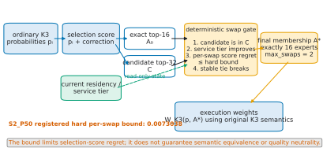

**Figure 6 — Bounded cache-aware membership selection.** Ordinary K3 scores define exact top-16 and candidate top-32. Service state permits replacement only for a better tier within the hard per-swap bound and `max_swaps = 2`. Final membership is exactly 16 and uses original K3 weights. The operational bound does not guarantee semantic equivalence or quality neutrality.

## 5.5 Policy selection and freeze

The routing constants were not chosen from the later cross-workload or long-horizon quality results. The short-horizon study first established the K3-specific opportunity frontier, the exact top-32 instrumentation, and the observed regret thresholds used to define bounded candidate policies. Its first runtime recommendation was the conservative one-swap p25 KNEE point; the more aggressive p50 settings remained diagnostics because their incremental locality gains saturated while predictive perturbation increased.

The later policy-selection study then asked a different, protocol-distinct physical question at a higher pressure-safe cache point. It kept the top-32 candidate envelope and already-tested regret thresholds fixed, then compared seven registered swap/regret profiles. Applying its preregistered selection rule chose S2_P50: its screening median was 7.708% higher than KNEE while measured loads and bytes per token were 15.866% lower, and the one permitted three-pair confirmation reproduced S2_P50/KNEE TPS gains of 6.832%, 6.857%, and 7.110%. These values explain why S2_P50 superseded the earlier conservative KNEE recommendation for subsequent systems evaluation; they are selection-protocol context and are not pooled with later absolute physical results.

After that selection, the policy was frozen as \((M,S_{\max},\epsilon)=(32,2,0.007303759455680847)\). The frozen cross-workload campaign subsequently evaluated its systems behavior across the frozen workload corpus, and the long-horizon study subsequently evaluated long-horizon predictive effects. Neither campaign retuned candidate count, swap count, or regret threshold from its own outcomes. EXACT remains the default/reference policy throughout.

## 5.6 A local bound is not a semantic guarantee

The two hard bounds say exactly how far the routing mechanism may depart from the exact decision operationally: no accepted pair may exceed \(\epsilon\) in K3 selection score, and no routed layer may contain more than \(S_{\max}\) intentional substitutions. They do not bound the difference between the selected experts' functions. A locally small score gap can still change the MoE output, subsequent hidden state, later routing decisions, logits, and eventually the generated-token trajectory.

We therefore use **selection-score regret**, not semantic regret, throughout. The later controlled long-horizon study reinforces this boundary: cumulative corrected-selection regret is only a weak predictor of predictive damage, and the frozen evidence does not justify replacing the local operational bounds with a new quality-driven adaptive rule. Section 8 measures those predictive effects directly rather than treating the local score threshold as a safety certificate.

## 5.7 Relationship to cache-aware routing prior art

Cache-aware expert selection itself is established prior art. **Mixture of Cache-Conditional Experts** is the closest conceptual predecessor: it already demonstrates training-free routing in which cache state influences expert membership and evaluates an explicit quality/locality frontier. Our mechanism should therefore be read as a more tightly bounded K3-specific point in that design space, not as the invention of cache-aware routing. Its distinguishing control is to begin from K3's exact top-16 and permit only deterministic substitutions from a fixed top-32 envelope under both a hard per-swap K3 selection-score regret limit and a hard swap-count limit, while retaining K3's original final-weight semantics.

**MoE-ERAS** predates our work in making expert residency part of the selection objective and in treating performance and accuracy as a joint trade-off. Relative to that line of work, our focus is narrower: contemporaneous provider residency is used only to choose among K3 near-tie candidates that already satisfy explicit exact-route-relative bounds. We then measure the real subsequent route stream rather than assuming that an offline replacement leaves future routing unchanged.

**ReMoE** targets the same underlying locality problem through router fine-tuning that encourages temporal expert reuse. Our policy instead leaves router parameters untouched and applies a deterministic inference-time membership substitution. Training-free operation is a design difference, not a priority claim: ReMoE, Cache-Conditional Experts, and MoE-ERAS all establish that routing locality is a legitimate systems control surface and that its quality cost must be evaluated.

The contribution evaluated in this paper is consequently narrower than “cache-aware MoE routing”: a hard-bounded membership policy for K3's 896-to-16 router, integrated with explicit NVMe-backed residency so its physical effect can be measured, followed by controlled analysis of real route evolution and long-horizon predictive consequences. We make no claim of being first to use cache or residency in MoE routing.

---

# 6. Implementation

Our prototype is implemented in the repository-pinned llama.cpp/GGML Kimi K3 runtime. The implementation changes how routed expert weights are materialized and, when the bounded policy is enabled, which already-ranked experts are selected; it does not replace the model's ordinary non-expert execution path. This section records only the implementation details needed to reproduce and interpret the primary physical measurements.

## 6.1 llama.cpp / GGML integration

K3 routing remains on the accepted llama.cpp/GGML path. At each routed layer, the selected expert IDs cross a provider boundary before expert execution: the provider resolves each `(layer, expert_id)` to a cache-resident ExpertBundle or services it from backing storage. Persistent residency metadata and buffers are owned by the provider/cache rather than graph-temporary allocation, so a cache hit denotes bytes whose lifetime extends across graph executions.

The storage path is independent of the routing policy. With cache-aware routing disabled, the ordinary K3 top-16 membership is passed unchanged through the same provider and is the default/reference path. With the bounded policy enabled, only the final selected IDs can differ; materialization, cache lookup, and expert execution use the same provider interface after membership is fixed.

## 6.2 GGUF / MXFP4 expert storage

We retain K3's accepted GGUF/MXFP4 routed-expert representation. The loader associates each ExpertBundle with explicit backing-file spans and offsets for the routed gate, up, and down tensors and the quantization metadata needed by the existing K3 CPU execution path. A miss materializes the required bundle into a bounded cache slot rather than materializing the complete expert pool in DRAM.

The out-of-core mechanism does not introduce a second routed-expert quantization format or a quality-changing requantization step: resident and backing-served experts use the same accepted MXFP4 representation. Layout and repacking minutiae that do not alter the evaluated I/O path are left to the artifact documentation.

## 6.3 Linux backing path

The primary physical campaign exercised full K3 on the CPU-only Mode-P/BATCHED path with 32 inference threads. Expert misses were served from a single local NVMe backing device through native `io_uring` and `O_DIRECT` into the bounded managed host cache. The measured capacity was fixed at 7,849 ExpertBundle slots (137,728,475,136 bytes). Each timed run used a fresh process and a cold managed-cache start so that managed residency, rather than a warm process-local cache, defined the initial state.

The runtime records queue/resource failures and fallback state so that an unintended buffered or synchronous path is not silently interpreted as the qualified direct-I/O configuration. These details describe the frozen physical regime specifically; earlier campaigns and other hosts are kept protocol-distinct rather than folded into one hardware configuration.

## 6.4 Instrumentation and reproducibility

The runtime records cache hits and misses, backing loads and transferred bytes, and routing substitutions with their swap counts and selection-score regret. It also captures resource-pressure, OOM, and fallback truth needed to distinguish successful qualified runs from degraded execution. Timed physical runs are kept separate from observer captures used for route/locality analysis, so observer timing is not treated as physical throughput evidence.

Paper figures and secondary analyses are regenerated from the frozen evidence releases rather than from ad hoc reruns. The final curated analysis and long-horizon analysis use immutable manifests/artifacts and deterministic offline regeneration where applicable. Exact command lines, complete schemas, release-member indices, checksums, retry/resume procedures, and detailed software/host identities are reserved for the appendix and artifact documentation.

---

# 7. Evaluation: Systems, Locality, and Capacity

We evaluate the systems mechanism with five questions: whether full K3 can execute under a bounded NVMe-backed expert-service regime; whether the selected two-swap policy improves physical throughput and locality at fixed cache capacity; whether the observed behavior extends across the frozen workload corpus; whether physical backing demand explains throughput; and how much exact-routing cache would be required to match the locality physically achieved by the selected policy. Physical claims in the first four questions come from the frozen cross-workload campaign. The final curated analysis is used only for curated or derived analyses and retains its original evidence classes; in particular, replayed capacities and projected TPS are not physical measurements.

For readability, we use the following policy labels throughout the evaluation:

| Label | Reader-facing meaning |
|---|---|
| `EXACT` | original K3 top-16 membership; no cache-aware substitution |
| `KNEE` | tighter one-swap comparison policy using the lower p25 regret bound |
| `S2_P50` | selected two-swap policy using the p50 hard regret bound |

Evidence labels also distinguish what was physically run from what was observed or derived:

| Evidence label | Meaning / claim boundary |
|---|---|
| `MEASURED_PHYSICAL` | timed physical execution under the stated runtime protocol |
| `MEASURED_OBSERVER` | untimed route/working-set observation; not performance evidence |
| `EXACT_REPLAY` / `FIXED_ROUTE_COUNTERFACTUAL` | offline replay or what-if analysis; not a physical run |
| `POST_HOC_EXPLORATORY` | analysis defined after the underlying data were frozen; useful in-domain but not preregistered confirmation |
| `TPS_PROJECTION` | fitted throughput estimate from nonphysical inputs; never relabeled measured TPS |

## 7.1 Experimental setup

Table 1 summarizes the primary physical regime. We evaluate `moonshotai/Kimi-K3@9f62e4e9fffbd0a83ddd60e1c209d828994b3569`, with 92 routed layers, 896 routed experts per layer, and exact top-16 selection. The storage/cache service unit is one 17,547,264-byte ExpertBundle. The measured runtime is CPU-only Mode-P/BATCHED with 32 inference threads. Routed experts are backed by one local NVMe device and serviced through native `io_uring` + `O_DIRECT` into a managed cache of 7,849 ExpertBundle slots (137,728,475,136 bytes, 128.27 GiB).

| Component | Frozen physical setting |
|---|---|
| Model | Kimi K3, 92 routed layers, 896 experts/layer, top-16 |
| ExpertBundle | 17,547,264 B per `(layer, expert)` |
| Managed cache | 7,849 slots = 137,728,475,136 B (128.27 GiB) |
| Execution | CPU-only Mode-P/BATCHED, 32 threads |
| Backing path | single local NVMe, native `io_uring` + `O_DIRECT` |
| Context | `n_ctx = 768` |
| Run isolation | fresh process/model/provider/context; cold managed cache |
| Measured window | 64 complete one-token decode forwards |
| Policies | EXACT, KNEE, S2_P50 |

The final full-prompt measurement boundary was frozen only after a pre-result protocol check showed that the earlier policy-selection helper could not answer the cross-workload question. That helper accepted one fixed roughly 100-token prompt, stopped prompt ingestion when the managed cache first became full (token 9 in its frozen signature), and used `n_ctx = 256`. Those semantics were valid for the earlier policy-shape experiment, but they would have made nominal prompt-length comparisons largely a comparison of the same short prefix. The cross-workload study therefore stopped before any primary performance/locality outcome was inspected and introduced a measurement-only full-prompt boundary.

Under the final protocol, each run starts from an empty managed cache, consumes the complete templated prompt under EXACT routing, and preserves the resulting cache contents. At the prompt/decode boundary the requested decode policy is enabled and counters are reset, so prefill is excluded from decode TPS. S2_P50 uses `candidate_count = 32`, `max_swaps = 2`, and `max_score_regret = 0.007303759455680847`; KNEE is the one-swap p25 comparison. Figure A2 shows why early-first-full and full-prompt measurements are not pooled.

Tokenizer/template preflight produced a second pre-outcome correction. The guessed absolute post-template length bands failed for all 128 prompts, but templated length increased strictly from level 1 through level 8 within every semantic family. We therefore froze the exact prompts rather than rewrite them, reinterpreted the design as eight ordered within-family length levels, retained actual templated token count as the quantitative variable, and increased the context budget to `n_ctx = 768`. The accepted prompt lengths span 154–599 tokens; every case plus the 64-token decode window fits. These changes define what the later family and length effects mean; they are protocol qualification, not outcome-driven retuning.

The workload contains 128 primary prompts arranged as 16 semantic families × 8 ordered within-family length levels; actual templated-prompt tokens are retained separately as the quantitative length variable. Eight full-prompt sentinels provide drift control. The observer subset (Stage B in the provenance) selects 16 family representatives for untimed route analysis. The matched comparison subset (Stage C in the provenance) uses a non-random set of 24 unique prompts—the 16 representatives plus four low- and four high-locality cases—and adds one fresh EXACT and one fresh KNEE process for each prompt while reusing its already-frozen S2_P50 row. Thus the matched subset contributes 48 new physical comparison runs without rerunning S2_P50, with one physical observation per prompt/policy cell. The earlier policy-selection study is used only to document policy-selection history; none of its absolute TPS or locality values are pooled with the full-prompt cross-workload measurements reported here.

The main physical window contains 64 complete decode forwards. Figure A3 retains a separate three-prompt 16–512-token systems diagnostic; every path is non-monotonic, so 64 tokens is not called steady state. Immutable identities and checksums remain in artifact provenance.

## 7.2 RQ1: Can full K3 execute with NVMe-backed expert service in this regime?

Yes, within the qualified physical regime. The campaign produced all 128 primary S2_P50 measurements and all 24 matched comparison pairs without a failed comparison cell, while preserving the native direct-I/O path and bounded managed cache. Across the 128 primary prompts, measured S2_P50 decode throughput has median 0.3291 token/s, with p10–p90 0.3134–0.3456 token/s and range 0.3050–0.3573 token/s. The corresponding median hit ratio is 0.6303 and median backing demand is 544.23 loads/token (9.55 GB/token).

These results establish feasibility and a physical operating envelope, not interactive usability. Absolute throughput is specific to this CPU/NVMe execution regime, representation, capacity, and host. Our subsequent claims therefore focus on paired effects and on the amount of expert demand crossing the backing boundary rather than treating the measured token rate as a hardware-independent property of K3.

## 7.3 RQ2: Does S2_P50 improve physical performance at fixed capacity?

Yes on every prompt in the matched comparison subset. Table 2 reports paired `MEASURED_PHYSICAL` results at the same 7,849-slot cache capacity. Relative to EXACT, S2_P50 improves decode TPS in 24/24 prompts, with a median ratio of 1.1049 (10.49% higher) and a range of 1.0296–1.1458. Relative to KNEE, it also wins 24/24, with a median ratio of 1.0622 (6.22% higher) and a range of 1.0044–1.0975.

| S2_P50 relative to | TPS ratio, median (range) | Median Δ hit ratio | Median Δ loads/token | Median Δ backing bytes/token | TPS wins |
|---|---:|---:|---:|---:|---:|
| EXACT | 1.1049 (1.0296–1.1458) | +0.06938 | -102.125 | -1,792,014,336 B | 24/24 |
| KNEE | 1.0622 (1.0044–1.0975) | +0.04030 | -59.320 | -1,040,909,184 B | 24/24 |

The direction is equally consistent for locality: S2_P50 has a higher hit ratio and fewer backing loads in all 24 comparisons against both EXACT and KNEE. The throughput gain therefore coincides with less physically serviced expert traffic, rather than with additional measured cache capacity. Because the ExpertBundle size is fixed, the load-count and backing-byte reductions describe the same physical demand at two useful units: expert services and transferred bytes.

## 7.4 RQ3: Does the behavior extend across workloads?

The frozen corpus shows broad but workload-conditioned behavior. Across the 128 primary S2_P50 runs, TPS spans 0.3050–0.3573 token/s, hit ratio spans 0.5811–0.6798, and backing demand spans 471.33–616.58 loads/token. A family-only decomposition accounts for about half of the observed variation in TPS (R² = 0.497) and hit ratio (R² = 0.500), whereas length level alone explains little (R² = 0.0045 for TPS and 0.0088 for hit ratio). The frozen cross-workload campaign therefore classifies the semantic-family effect as strong, the token-length effect as weak, route coverage as broad, and cross-prompt dispersion as high.

The sentinels separate this workload dependence from timing drift. Their deterministic route/locality signatures remain equal across rounds, while their TPS p90–p10 spread is 0.00143 token/s. The primary-prompt p90–p10 TPS spread is 0.03224 token/s, 22.6× larger. Host noise is therefore visible but too small to explain the cross-prompt range. The matched comparison subset then supplies the paired check: S2_P50 remains faster than both EXACT and KNEE throughout its 24 cross-family/locality-selected prompts, although the gain magnitude varies and the KNEE/S2_P50 interaction is classified as moderate. These results support broad generalization within the frozen 16×8 K3 corpus; they do not establish universal prompt or cross-model behavior.

Figure 3 shows the 128-prompt distribution and sentinel reference; Figure 7 isolates every matched contrast.

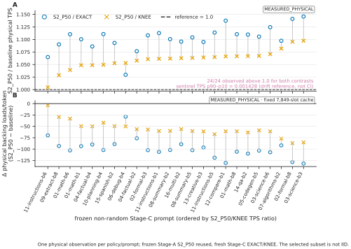

**Figure 7 — Matched-subset physical comparisons (`MEASURED_PHYSICAL`; Stage C in provenance).** Panel A retains S2_P50/EXACT and S2_P50/KNEE TPS ratios for all 24 selected prompts; Panel B retains backing-load deltas at 7,849 slots. All ratios exceed 1.0 and all deltas are negative. One observation contributes to each cell; 24/24 describes the selected subset, not a CI or population probability.

## 7.5 RQ4: How does backing demand relate to throughput?

The physical comparison shows a co-occurring systems pattern—S2_P50 reduces backing loads at the same time that TPS rises—and the final curated analysis characterizes that association more systematically. Using only protocol-compatible `MEASURED_PHYSICAL` rows from the frozen cross-workload campaign, its post-hoc leave-one-family-out model with loads/token as the primary predictor obtains R² = 0.993536 and RMSE = 0.000928 token/s. A protocol-compatible sensitivity fit gives LOFO R² = 0.992656. A separate working-set analysis finds that the best single frozen feature, `top16_selected_mass_fraction`, explains physical hit-ratio variation only moderately (pooled LOFO R² = 0.465884).

The distinction is important. Route structure helps explain where reuse can arise, while the number of ExpertBundles actually serviced from backing storage is tightly associated with measured decode throughput in this regime. The two reported fits have different targets and are not compared as predictor alternatives. We treat the source TPS and load counters as `MEASURED_PHYSICAL`, while the fitted relationships are `POST_HOC_EXPLORATORY`. The final curated-analysis projection gate passes within the measured predictor domain, but projected TPS is not used here as physical evidence and is not extrapolated beyond that domain.

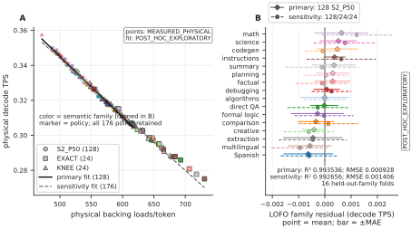

**Figure 8 — Backing loads/token and decode TPS.** Panel A retains all 176 protocol-compatible `MEASURED_PHYSICAL` points: 128 primary S2_P50 observations plus 24 matched-subset EXACT and 24 matched-subset KNEE observations. Marker shape exposes policy and color exposes the 16 semantic families. The solid primary fit uses only the 128 S2_P50 rows; the dashed sensitivity fit uses all 176 rows. Both fits are `POST_HOC_EXPLORATORY`. Panel B retains all 16 held-out-family residual summaries for both validations: primary R² 0.993536 and RMSE 0.000928 token/s; sensitivity R² 0.992656 and RMSE 0.001406 token/s. The matched-subset rows test protocol-compatible sensitivity rather than broadening the primary model. Association is not causality. The 0.465884 working-set result predicts hit ratio, not TPS.

## 7.6 RQ5: What exact-cache capacity would match S2_P50 locality?

A larger exact cache provides the natural memory-for-locality baseline, but the frozen cross-workload campaign does not physically rerun EXACT at every larger capacity. We therefore answer this question only as a counterfactual. The final curated analysis places the locality physically achieved by S2_P50 at the measured cache on the frozen EXACT replay capacity curve and reports discrete capacity brackets rather than fitted thresholds. All 44 published cases are bracket-consistent.

For the hit-derived physical-reference comparison, the median lower and upper endpoints of the EXACT capacity-amplification interval are 1.247× and 1.497× the measured reference capacity. Across cases, lower endpoints range from 1.000× to 1.497× and upper endpoints from 1.247× to 1.996×. Thus, according to the frozen EXACT replay curve, the locality physically reached by S2_P50 often corresponds to an EXACT cache bracket larger than the cache actually used by S2_P50.

This is `EXACT_REPLAY`/counterfactual evidence combined with `POST_HOC_EXPLORATORY` analysis. No larger-cache EXACT TPS is measured by this result, and the interval is neither a measured RAM saving nor an exact memory threshold. Its role is narrower: it expresses the S2_P50 locality improvement in the same resource coordinate that an exact-routing system would otherwise spend—cache capacity.

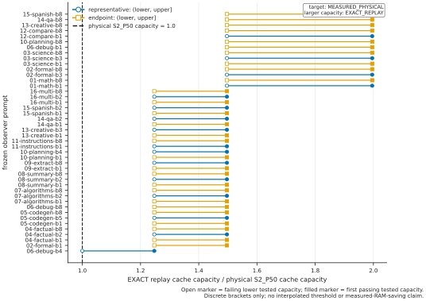

**Figure 9 — Exact-cache locality-equivalence brackets.** For all 44 prompts, `MEASURED_PHYSICAL` S2_P50 locality is matched to tested `(lower, upper]` `EXACT_REPLAY` brackets; `INCONCLUSIVE` is preserved. This `POST_HOC_EXPLORATORY` counterfactual is not an interpolated threshold, measured RAM saving, projected TPS, or physical larger-cache run.

## 7.7 Evidence boundaries

The evaluation intentionally keeps measurement and inference separate. RQ1–RQ3 use the frozen cross-workload campaign physical runs; observer captures contribute route structure but never timed throughput. RQ4 uses measured physical inputs, but its regression is an after-the-fact exploratory analysis from the final curated analysis. RQ5 uses physical S2_P50 locality as a target and exact-route replay for hypothetical capacities. Any TPS obtained by applying the final fitted model to a replayed capacity is a `TPS_PROJECTION`, not a measured physical run. Finally, the earlier policy-selection study remains protocol-distinct policy-selection context and is not merged into the frozen cross-workload campaign absolute distributions or calibration data.

---

# 8. Performance–Quality Trade-off

Section 7 shows that S2_P50 reduces physical expert-service demand and improves measured throughput at fixed cache capacity. That gain is obtained by intentionally changing expert membership, so the router-score bounds in §5 cannot by themselves establish that model behavior is unchanged. We follow the perturbation through a sequence of increasingly demanding questions. First, teacher forcing asks whether bounded swaps perturb the network even when token history is held fixed. Second, a longer fixed-context study asks whether that direct perturbation accumulates in predictive likelihood. Third, we test whether the router telemetry already available at runtime—regret and changed-route fractions—predicts that damage well enough to justify a semantic-risk controller. Finally, after the direct effect and its possible proxy are characterized, we close the autoregressive loop and measure what changes when the perturbed model conditions on its own tokens. These are predictive and internal-model measurements; they are not task-accuracy results.

## 8.1 Short-horizon controlled perturbation

The original short-horizon instrumentation holds the token history fixed by teacher-forcing the exact reference sequence while changing only the routing policy. For each decode step it records the intentional membership changes together with local MoE-output divergence, downstream hidden-state divergence, later route changes, logit KL/JS, top-token agreement, and reference-token NLL. This exposes the propagation chain directly:

```text
intentional expert substitution
      -> changed MoE output
      -> changed hidden state
      -> changed later routing / logits
      -> changed reference-token likelihood
```

Across the retained 24-token frontier traces, increasing routing aggressiveness produced larger MoE-output and hidden-state divergence, while next-token top-1 agreement remained 23/24 at every retained point. The coexistence is important: a mostly unchanged argmax over a short horizon does not imply that the predictive distribution or internal trajectory is unchanged. Small membership changes can persist in hidden state and can alter later routing even when both runs are forced to consume the same next token.

Teacher forcing deliberately removes one source of amplification. Because the EXACT and changed runs consume the same reference-token history, differences measured in this mode arise from the routing intervention and its propagation through the network, not from the changed model sampling a different token and then conditioning on that token later. The short-horizon study therefore establishes the direct perturbation mechanism; the final long-horizon study is the authority for how that effect behaves over longer horizons.

## 8.2 Long-horizon predictive drift

The long-horizon study extends the fixed-context comparison across 16 frozen prompt clusters and measures the changed policies against the exact reference trajectory through the registered long horizon. For reference token \(y_t\), we use the change in negative log-likelihood,

\[
\Delta \mathrm{NLL}_t = \mathrm{NLL}_{\mathrm{changed}}(y_t) - \mathrm{NLL}_{\mathrm{EXACT}}(y_t),
\]

so positive values mean that the changed policy assigns lower probability to the token on the exact reference continuation. The principal S2_P50 result is positive and measurable: mean direct reference-NLL damage is `+0.012030` across the 16 prompt clusters, with a 95% cluster-bootstrap interval of `0.008440..0.015435`.

The trajectory is classified as `gradual`, and the preregistered breakpoint comparison provides only weak evidence for an abrupt change point. Predictive damage therefore accumulates over the measured horizon without a supported sharp threshold at which the bounded router suddenly becomes unsafe. The amount and shape of drift remain prompt-dependent, which is why we report the aggregate interval together with per-prompt trajectories rather than reduce the result to a single deterministic penalty.

This metric answers a narrow question: how much the changed router perturbs likelihood on a controlled reference continuation. It does **not** measure task accuracy, answer correctness, human preference, or semantic equivalence. A positive ΔNLL establishes predictive cost under the intervention; task-level capability remains a separate experiment.

Figure 10A retains all 16 prompt paths and the accepted min–max aggregation; Panels B–D show the controlled bridge.

## 8.3 KNEE versus S2_P50: no clear quality ordering

KNEE provides a useful comparison because its local approximation is tighter than S2_P50: it allows one swap per routed layer under the lower p25 score-regret bound, whereas S2_P50 allows two swaps under the p50 bound. If local router-score regret were a reliable monotonic proxy for long-horizon predictive quality, KNEE should therefore be clearly favored.

The registered long-horizon comparison does not show that ordering. The S2_P50-minus-KNEE difference in reference-NLL damage is `+0.001090`, with a 95% interval of `-0.001228..0.003205`; the study classifies the result as `no_clear_difference`. The point estimate is compatible with somewhat higher S2_P50 damage, but the interval crosses zero, so the measured data do not support a clear KNEE-versus-S2 ordering.

This is not an equivalence result. It shows only that the lower local regret/swap budget did not produce a clearly lower long-horizon predictive cost in the frozen cohort. Combined with §7, where S2_P50 has the stronger physical locality result, the comparison illustrates why the design space cannot be reduced to one scalar “regret” dial: a tighter local routing bound and a better systems point need not induce a clearly ordered long-horizon predictive outcome over the measured range.

## 8.4 Simple regret summaries do not predict long-horizon damage well

A natural hope is that the operational bounds already available to the router could also act as an inexpensive semantic-risk controller. The long-horizon study tests this directly with nested leave-one-family-out predictors of long-horizon ΔNLL. The baseline using only cumulative maximum and mean corrected regret per swap has LOFO R² `0.0169`. Adding cumulative corrected regret raises LOFO R² to `0.1513`, but the registered incremental result is only `weak`. Adding signed raw regret reaches R² `0.1800`, with raw regret again classified as only weak additional signal.

Adding how much of the route was changed does not repair the predictor. Including changed-slot and perturbed-layer fractions reduces held-out R² to `0.1423` and is classified as providing `no` additional signal; the subsequent depth-conditioned model reaches R² `0.1306`, with depth conditioning likewise unsupported. These held-out results matter more than an in-sample correlation because the intended use would be to predict damage on a different workload family.

The negative result does not mean router-score regret is irrelevant. Per-swap regret remains the hard operational constraint that makes every substitution local, deterministic, and auditable. What fails is the stronger claim that simple accumulated regret, raw-regret, or perturbation-fraction summaries are sufficient long-horizon semantic-safety proxies. We therefore closed the adaptive regret-controller branch rather than introducing a quality-triggered routing rule: `FOLLOWUP_ROUTING_DESIGN_JUSTIFIED = no`.

## 8.5 Direct perturbation versus autoregressive feedback

Fixed-context evaluation isolates the routing intervention from changed token history, but production generation closes the autoregressive loop. Once a changed policy samples a different token, that token becomes part of the next context and can alter hidden state, expert routing, and subsequent token probabilities independently of the original local substitution. The long-horizon study measures this additional mechanism on three frozen bridge prompts through horizons up to 1,024 tokens using two controlled evidence classes:

- `DIRECT_FIXED_CONTEXT`: changed routing consumes the EXACT reference-token trajectory;
- `FREE_TRAJECTORY`: changed routing consumes its own generated tokens.

The direct/free contrast isolates the token-mediated feedback increment under this setup. It is not computed from physical-versus-replay locality, and replay differences are not used as a causal feedback estimate.

The long-horizon study classifies token-mediated route feedback as `material`. For the registered amplification effect, the free trajectory amplifies the corresponding direct perturbation by a mean `1.4210×`, with a 95% interval of `1.2225..1.7099`. Growth through 1,024 tokens is classified as `heterogeneous`: some prompt-policy trajectories grow while others are non-monotonic. The result therefore supports a feedback loop, not a universal exponential-growth law.

The `1.4210×` value is an amplification factor for the controlled measured effect. It must not be read as “1.42× worse quality,” nor can it be converted into an accuracy loss. Its systems significance is that direct predictive perturbation understates the full behavior of an autoregressive generator: changed membership can first perturb the distribution and then change the future context on which subsequent routing decisions operate.

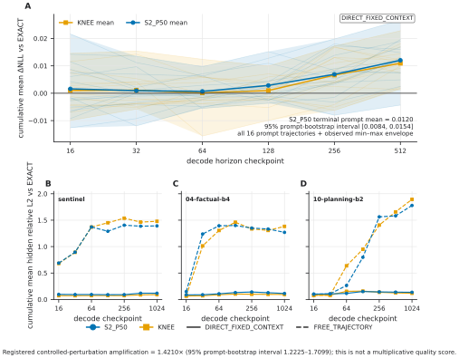

**Figure 10 — Predictive damage and controlled feedback.** Panel A retains all 16 `DIRECT_FIXED_CONTEXT` paths, means, and observed min–max envelopes; ΔNLL is not accuracy. Panels B–D retain all bridge prompts and distinguish `DIRECT_FIXED_CONTEXT` (solid) from `FREE_TRAJECTORY` (dashed). The 1.4210× summary is perturbation amplification, not “worse quality”; growth is heterogeneous.

## 8.6 Task-level capability remains open

The predictive experiments above deliberately stop short of a task-level acceptability claim. No accepted GPQA result is available; its validation plan states that no GPQA task-quality outcome has been generated or inspected. Its planned evidence separates a 30-item paired local EXACT-versus-S2_P50 comparison from a full 198-item S2_P50 run; Moonshot's published GPQA score remains only an external `OFFICIAL_PROTOCOL_NEAR_MATCH` reference, not a local EXACT baseline.

The standard-suite validation remains pending. Its intended standard-suite design separates likelihood-based MMLU-family scoring, which is primarily sensitive to direct predictive/logit changes, from GSM8K-family free generation, where the token-mediated feedback measured above can accumulate. No accepted result from either task family is available to populate this section.

Accordingly, we do not convert ΔNLL, top-token agreement, autoregressive amplification, or regret-predictor performance into task accuracy. Until accepted task-level evidence exists, the supported conclusion is predictive rather than task-level: S2_P50 changes the model's predictive trajectory measurably, and free generation can amplify that change.

## 8.7 Implication for the systems frontier

The performance result and the quality result are two sides of the same intervention. S2_P50 reduces physically serviced expert demand at a fixed measured cache capacity, but it does so by changing bounded expert membership. Those changes create measurable long-horizon predictive drift, and autoregressive token feedback can amplify the direct effect. Hard local regret bounds keep the approximation constrained and auditable, but the tested accumulated local statistics are not a sufficient long-horizon quality controller.

The current evidence therefore supports a performance–quality trade-off, not semantic equivalence. Figure 11B joins physical load reduction to fixed-context damage for 16 prompts; its inverse association is exploratory, not causal. Capacity changes realized substitutions and damage in the three-prompt bridge (Figure A4), so it remains part of quality analysis without implying a universal law.

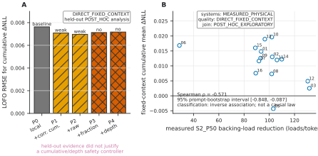

**Figure 11 — Controller decision and systems–quality association.** Panel A shows five held-out predictors: cumulative regret terms add only weak signal and perturbation fraction/depth add none. The result closes the adaptive regret-controller branch (`ADAPTIVE_REGRET_CONTROLLER_NOT_JUSTIFIED`; frozen outcome `FOLLOWUP_ROUTING_DESIGN_JUSTIFIED = no`); no semantic-risk controller was introduced. Panel B joins `MEASURED_PHYSICAL` load reduction to `DIRECT_FIXED_CONTEXT` ΔNLL for all 16 prompts and is `POST_HOC_EXPLORATORY`. The inverse association is neither causal nor universal.

Routing slack is usable on Kimi K3, but spending it changes the model; performance, memory locality, and predictive quality must be evaluated jointly.

---

# 9. Understanding K3 Expert Locality

Most numerical and statistical analyses in this section come from the final reviewed curated package and are **`POST_HOC_EXPLORATORY`**. One earlier static-router analysis, described at the start of §9.1, is separate frozen evidence and is used only to explain a closed hypothesis branch. The selected-route captures describe which `ExpertKey`s recur; they are not timed execution measurements. The static-pinning experiment below is a `FIXED_ROUTE_COUNTERFACTUAL`, not a physical benchmark. These dynamic analyses were also performed after S2_P50 and the primary measurements were frozen, so they interpret the observed locality structure rather than motivating the policy retrospectively.

## 9.1 Workload-dependent working sets

Before using route-frequency structure as an explanation, we tested a simpler static hypothesis: whether router-weight geometry itself exposed broad expert families that could serve as a placement prior. It did not. Apparent high silhouette scores came from tiny one-to-three-expert outlier splits, while the strongest reasonably balanced split had silhouette `0.0212`. We therefore did not promote static router clusters into a cache or routing policy; the dynamic observer analyses below ask a different question about realized selection and reuse.

The curated route summaries do not support one workload-independent expert working set. Under the final curated analysis's frozen route-demand representation, the median cosine similarity between the B1 and B8 endpoints of the same workload family is `0.565156`, compared with `0.420729` between B1 cases from different families. The final curated analysis classifies this family association as supported while retaining substantial overlap and heterogeneity. The result says that route-demand profiles are more similar within the predefined workload groups on average; it does **not** say that individual experts implement the semantics named by those groups.

Working-set size and concentration also resist a one-dimensional prompt-length explanation. Across the 16 frozen B1/B8 endpoint pairs, the median number of distinct routed `ExpertKey`s is 28,759.5 at B1 and 28,971 at B8. Median mean-layer effective-expert count is 198.95 versus 200.38, mean-layer entropy is 7.553 versus 7.562 bits, and top-16 selected-mass fraction is 0.2805 versus 0.2817. The p90 finite stack distance is more separated—33,630 at B1 versus 40,081 at B8—but the final curated analysis's family-adjusted actual-length hypothesis remains `weak`, with heterogeneous slopes and influential-case sensitivity. We therefore use length endpoints as descriptive stress points, not as evidence for a universal monotonic length-to-locality law.

These structural descriptors explain only part of locality itself. The strongest single frozen working-set feature, `top16_selected_mass_fraction`, predicts physical hit-ratio variation with pooled leave-one-family-out R² = `0.465884`; the final curated analysis accordingly classifies the broader working-set/reuse hypothesis as `weak`. This is enough to show that route structure contains reusable signal, but not enough to reduce locality to one compact working-set statistic.

## 9.2 A recurrent core with a large workload-conditioned periphery

The final curated analysis next asks whether frequent selections contain a cross-workload core. The observable is deliberately narrow: selected top-k/top-M frequency only, without a complete routing-weight profile. On decode, the strictest core—`ExpertKey`s selected in all 16 workload families (`γ = 1.0`)—contains 1,422 keys, only `1.725%` of all routed `ExpertKey`s in the analysis, yet carries `13.329%` of selected decode mass. Relaxing recurrence to at least 13 of 16 families (`γ = 0.8`) expands the core to 6,939 keys (`8.418%`) and `34.808%` of selected mass; requiring recurrence in at least half the families (`γ = 0.5`) yields 25,046 keys (`30.384%`) and `69.275%` of selected mass.

The useful picture is therefore graded rather than binary. A small universally recurrent routed core exists, but most selected decode mass lies outside that strict core, and the amount captured as “core” changes substantially with the recurrence threshold. We call the remainder a workload-conditioned periphery only in this frequency/overlap sense. Routing frequency does not identify an expert's semantic function, and the final curated analysis explicitly marks core-versus-periphery reuse stratification as `INCONCLUSIVE` because the frozen summaries do not contain core/periphery-specific stack-distance distributions.

## 9.3 Why static core pinning is insufficient

A recurrent core is not automatically a good static cache allocation. The final curated analysis tests this with a same-capacity fixed-route counterfactual that reserves cache slots for increasingly broad recurring cores. Across the retained sweep, `308` cells regress in replayed hit ratio and `196` are infeasible because the pinned set consumes more capacity than the tested cell permits. The negative cases are preserved rather than averaged away.

The limitation remains even at the strictest core. With `γ = 1.0`, all 288 cells are feasible, but only 179 improve: 70 are unchanged and 39 regress. The mean hit-ratio delta is only `+0.000975`, with a range from `-0.058021` to `+0.016899`. At `γ = 0.8`, 115 cells improve, 64 are unchanged, 75 regress, and 34 are infeasible; the mean hit-ratio delta is `-0.023736`. Static pinning can therefore spend scarce slots on globally recurrent keys while displacing entries that matter more for the current route stream.

These numbers are **`FIXED_ROUTE_COUNTERFACTUAL` + `POST_HOC_EXPLORATORY`** evidence. They do not establish that a physical pinned runtime would lose TPS, and no projected or replayed throughput is promoted to a measured result here. The supported negative conclusion is narrower: the existence of a recurring selected-expert core does not imply that statically pinning that core improves the full same-capacity locality frontier. We therefore closed static global core pinning as a candidate same-capacity strategy rather than promoting it to a runtime policy.

The core-size and static-pinning summary is Figure A5 in Appendix C: it sharpens a limitation rather than adding a central physical result. Controlled quality analysis also found no supported core/periphery interaction, so no semantic-risk controller is inferred from recurrence.

## 9.4 From route structure to backing service to TPS

The analyses above separate three levels that are easy to conflate. Route structure describes where reuse *may* be available. Cache state and route evolution determine which selections actually miss. Physical backing loads measure the ExpertBundles that the runtime must service, and physical TPS is the resulting systems outcome in the evaluated regime.

The final curated analysis locality-to-throughput model makes this separation concrete. Using protocol-compatible physical inputs, `loads_per_token` predicts physical decode TPS with leave-one-family-out R² = `0.993536` and RMSE = `0.000928` token/s; the protocol-compatible sensitivity fit gives R² = `0.992656`. The fitted relationship is itself `POST_HOC_EXPLORATORY` even though its TPS and backing-load inputs are `MEASURED_PHYSICAL`. The `0.465884` working-set result above has a different target—physical hit ratio—so the two R² values are not a head-to-head comparison of predictors for the same quantity.

Together, the results suggest a disciplined systems sequence for analysis without claiming that the final curated analysis proves causality: route structure constrains the opportunity for reuse, realized residency determines backing service, and backing service is tightly associated with measured TPS in this CPU/NVMe domain. The final curated-analysis TPS projection gate passes only inside the measured predictor domain, but any TPS obtained by applying that model to replayed or counterfactual locality remains a `TPS_PROJECTION`, not physical evidence.

This distinction also clarifies what the post-hoc core analysis can and cannot say about S2_P50. It helps explain why a dynamic policy that consumes contemporaneous residency can exploit locality that no single static core captures, but it did not motivate S2_P50 and does not validate a new pinning policy. In the frozen K3 evidence, expert locality is best understood as an interaction between workload-conditioned selection, finite residency, and route evolution; its physical significance appears when that interaction changes the backing demand the runtime actually services.

---

# 10. Related Work

MoE systems expose two complementary control surfaces for memory-constrained inference. A runtime can make the router's exact expert choices cheaper to serve through placement, caching, prefetching, and heterogeneous execution; alternatively, routing itself can be made locality-aware so that the requested working set better matches available residency. We position this paper against both lines, and separately against work that characterizes the routing structure from which cache locality arises.

## 10.1 Expert offloading, caching, and local MoE serving

Expert-offloading systems exploit sparse activation by keeping only part of the expert pool in fast memory and servicing the rest from a lower tier. **MoE-Infinity** couples activation tracing with activation-aware expert caching and prefetching for resource-constrained personal-machine inference. **WASTE** and **Colibrì** are especially relevant same-model systems context because both execute full Kimi K3 while streaming routed experts from secondary storage: WASTE uses a custom 3-bit expert representation and bounded RAM cache, whereas Colibrì retains source-MXFP4 expert payloads and emphasizes direct I/O, layout, and CPU/Vulkan execution. **FreeToken** addresses an adjacent edge regime in which the expert pool is resident in host RAM and a global VRAM cache plus bandwidth-adaptive CPU/GPU miss execution determines where exact selected experts run. Related llama.cpp expert-cache proposals, tinyserve, and vLLM's `ExpertWeightProvider` work further establish persistent expert slots, mappings, and provider-mediated residency as systems architecture patterns.

These systems primarily optimize **where, when, or how an exact router-selected expert is materialized or executed**. Our runtime follows that architectural lineage rather than claiming expert slots, caching, asynchronous offload, or a provider abstraction as new primitives. The additional question studied here is whether the demand presented to that runtime can itself be reduced at fixed managed cache capacity by changing a small number of selected IDs under explicit bounds. The physical regime is also different from FreeToken's RAM-resident expert pool: our primary measurements keep the routed K3 store on NVMe behind bounded host residency. WASTE and Colibrì provide stronger full-K3 context, but their representation, hardware, cache hierarchy, and execution protocols differ from ours; their reported token rates are therefore qualitative feasibility/context points, not direct TPS baselines for the measurements in this paper.

## 10.2 Cache-aware and residency-aware routing

Using cache state to influence expert selection predates this work. **Mixture of Cache-Conditional Experts for Efficient Mobile Device Inference** (TMLR 2025) introduces a training-free cache-aware router that trades router preference for cached-expert reuse and evaluates the resulting locality/quality frontier. **MoE-ERAS** (MLArchSys 2024) likewise makes expert residency part of selection, using residency-aware router modifications to expose a performance/accuracy trade-off for offloaded MoEs. **ReMoE** (ICML 2026) attacks the same locality problem from the training side, fine-tuning the router to favor recently used experts and thereby increase temporal reuse. Together these works establish cache/residency-aware routing as an existing design space; we make no priority claim for introducing it.

The distinction in our mechanism is how departure from exact routing is constrained and how its consequences are measured. On K3's 896-expert, top-16 router, we start from the exact membership, expose only the top-32 candidate envelope, permit at most two substitutions per routed layer, and require every accepted swap to satisfy a hard K3 selection-score regret bound. The policy is deterministic and training-free, and after membership is chosen K3's original expert-weighting semantics are unchanged. We integrate that rule with explicit NVMe-backed residency and measure the resulting physical backing demand on full K3. We also retain the **real subsequent route evolution** produced by each intervention and separate long-horizon direct predictive perturbation from token-mediated free-generation feedback. Those controls make this a tightly bounded K3-specific point in the established cache-aware-routing space, not a claim that local router-score regret guarantees semantic safety.

## 10.3 Routing locality, specialization, and expert structure

Cache-aware serving depends on locality that is neither uniform across models nor necessarily reducible to one global hot set. **Not All Models Suit Expert Offloading: On Local Routing Consistency of Mixture-of-Expert Models** measures natural routing locality across 20 MoE LLMs and shows that cacheability varies materially with model architecture and routing behavior. Its main implication for this work is methodological: K3's locality must be measured from K3 route streams rather than inferred from results on DeepSeek, Qwen, Mixtral, or other MoEs.

Two closer structural studies frame the interpretation of K3's workload dependence. PipeNetwork's K3 REAP analysis reports domain-conditioned overlap in expert **saliency**, providing same-model evidence that expert structure can vary with source domain. Its observable is not our selected top-16 demand stream, cache reuse distance, or physical miss process, so we do not pool its overlap values with §9. **CommitteeAudit / Standing Committee** (ACL 2026) reports a cross-domain routed-expert core with a more task-specific periphery on other MoE models. Section 9 asks a related structural question on K3, but our frozen observer data contain selected top-k/top-M frequencies rather than the complete routing-weight profiles used by CommitteeAudit. We therefore treat the K3 core/periphery analysis as a `POST_HOC_EXPLORATORY`, selected-route analogue, and we do not transfer functional labels for individual experts from either line of work.

These prior results motivate the questions we ask about workload-conditioned working sets, shared cores, and peripheral demand; they do not determine the answer. In our evidence, the operational significance of route structure is established only when it changes realized residency and backing service. Likewise, the §9 static-core pinning experiment remains a fixed-route counterfactual: it tests whether one structural summary is sufficient for locality, not whether a recurring core has a particular semantic role or whether a physical pinned implementation would achieve a particular TPS.

---

# 11. Discussion and Limitations

## 11.1 What the evidence establishes

The central result is narrower than a new expert-cache architecture. The provider boundary, managed expert slots, asynchronous backing service, and cache hierarchy used here all have clear precedents in expert-offloading systems. What the K3 evidence establishes is that, once expert residency is explicit, a small amount of bounded routing slack can be used as a second systems control surface: at the same measured 7,849-slot cache capacity, the selected two-swap policy reduces the number of ExpertBundles that cross the backing boundary and improves measured decode TPS over both EXACT and KNEE in all 24 prompts of the matched comparison subset. The mechanism changes demand presented to the cache; it does not obtain the result by allocating a larger measured cache.

This demand-side control is complementary to making exact misses cheaper. Systems such as MoE-Infinity, WASTE, Colibrì, and FreeToken improve placement, prefetching, transfer, or execution of router-selected experts under different physical regimes. Nothing in our measurements shows that those exact-routing techniques are exhausted or unnecessary. A faster backing path can reduce the cost of every remaining miss, while bounded routing can reduce how many misses reach that path. The distinction matters because the measured K3 regime remains strongly sensitive to backing service: using protocol-compatible physical rows, the post-hoc curated analysis finds loads/token tightly associated with decode TPS under leave-one-family-out validation. We treat that relationship as an in-domain systems characterization, not as a universal performance law.

The resulting systems gain is also not free. S2_P50 intentionally changes expert membership, and the long-horizon study measures a positive long-horizon predictive cost under a fixed reference trajectory together with material token-mediated amplification under free generation. Taken together, the paper therefore establishes a K3-specific performance–memory-locality–quality trade-off: bounded residency-aware routing can reduce physical expert service at fixed measured capacity, but the approximation changes the model and must be evaluated as such.

## 11.2 Model generality

The primary evidence is specific to Kimi K3. The useful slack observed here depends on K3's 896-expert, top-16 routing geometry, its corrected selection score, the distribution of near-boundary candidates, and the realized residency opportunities of the measured workloads. S2_P50's top-32 envelope, two-swap limit, and `0.007303759455680847` score-regret threshold are therefore K3 operating parameters, not transferable constants for another MoE.

The same boundary applies to the locality analysis. The frozen K3 corpus exhibits workload-conditioned route demand and a recurrent selected-expert core with a large periphery, but §9 derives that structure post hoc from selected-route frequency and overlap. It neither assigns semantic functions to individual experts nor establishes that other MoEs have the same core/periphery shape. Prior cross-model work already shows that natural routing locality varies materially across architectures, so another model requires its own route, residency, and quality measurements before the same mechanism or thresholds can be justified.

Accordingly, the claim of this paper is “on Kimi K3,” not “for MoEs in general.” Cross-model studies could test whether the same bounded-demand principle transfers, but they are not part of the evidence required for the K3-specific result reported here.

## 11.3 Hardware and storage generality

The primary physical measurements also describe one concrete execution regime: CPU-only full-K3 decode, source-MXFP4 routed experts, a 7,849-slot managed host cache, one local NVMe backing device, and native `io_uring` + `O_DIRECT`. The measured absolute TPS and the numerical relationship between loads/token and TPS depend on that balance of compute, storage latency and bandwidth, memory capacity, representation, cache policy, and execution backend. A GPU-heavy system, a RAM-resident expert pool, multiple storage devices, a different quantization, or substantially faster backing I/O can move the bottleneck and change both the value of a cache hit and the benefit of avoiding a load.

For this reason, the portable quantity is the *physical expert-service demand to be measured*, not the particular slope or R² obtained on this host. The final locality-to-TPS fit is `POST_HOC_EXPLORATORY` and valid only within its measured predictor domain. Likewise, WASTE, Colibrì, and FreeToken provide important design and feasibility context but use different representations, memory hierarchies, hardware, and protocols; their reported token rates are not direct throughput baselines for our measurements. The cross-workload throughput envelope establishes feasibility in the qualified regime, not interactive usability or practicality on arbitrary consumer hardware.

The virtual-cache analysis has a still narrower interpretation. It places the locality physically achieved by S2_P50 on the frozen EXACT replay capacity curve and reports an interval of exact-cache capacities that would match that locality under the replayed route. This is a counterfactual exact-cache equivalence, not a physical experiment at the larger capacities. It therefore does not establish measured RAM savings, measured larger-cache EXACT throughput, or an exact memory threshold on this or another host. Its value is to express the locality gain in the resource coordinate that an exact-routing system would otherwise spend: cache capacity.

## 11.4 Quality and task validity

The hard router-score regret bound is an operational constraint, not a quality guarantee. It limits how far each selected-to-candidate substitution may move in K3's corrected selection score and, together with `max_swaps`, makes the approximation local and auditable. It does not bound the functional difference between two experts or the downstream effect of repeatedly changing membership. The long-horizon result makes that distinction empirical: S2_P50 increases reference-token NLL versus EXACT by `+0.012030` on average across the 16 fixed-context prompt clusters (95% cluster-bootstrap interval `0.008440..0.015435`), while simple cumulative-regret and perturbation-fraction summaries have weak or unsupported held-out predictive value for long-horizon damage.

Autoregressive generation adds a second validity boundary. Under the three controlled bridge prompts, free trajectories amplify the corresponding direct perturbation by a mean `1.4210×` (95% interval `1.2225..1.7099`), with heterogeneous behavior through 1,024 tokens. This is evidence that token-mediated feedback matters under the measured intervention; it is not a conversion factor from ΔNLL to answer accuracy, nor a statement that output quality is “1.42× worse.”

Task-level validity remains unresolved in the current manuscript. No accepted GPQA task-quality outcome has been generated or inspected, and independent MMLU-family and GSM8K-family validation remains pending. Moonshot's published GPQA score is an external near-match reference, not a local EXACT control. Until those experiments produce accepted evidence, the paper does not claim preserved task accuracy, semantic equivalence, or “no quality loss.” Even future small task deltas would support only the measured tasks and protocols; a mixed result across likelihood-based and free-generation tasks would be informative rather than something to collapse into a single quality-neutrality claim.

## 11.5 Evidence classes and interpretation

The paper deliberately combines evidence classes because they answer different questions, but their roles are not interchangeable. The strongest systems comparisons in §7 are `MEASURED_PHYSICAL`: fresh-process EXACT, KNEE, and S2_P50 runs at the same measured cache capacity. `MEASURED_OBSERVER` captures describe route and reuse structure without supplying physical throughput. `EXACT_REPLAY`, `FIXED_ROUTE_COUNTERFACTUAL`, and related counterfactuals ask what a frozen route or alternative residency allocation would have done without claiming that the corresponding system was physically run. `TPS_PROJECTION` denotes a fitted estimate, never a timed benchmark. The controlled long-horizon `DIRECT_FIXED_CONTEXT` and `FREE_TRAJECTORY` experiments form a separate quality evidence layer rather than being inferred from systems replay.

The main secondary analyses introduced by the final curated analysis—including locality-to-TPS modeling, virtual-cache equivalence, working-set predictors, and core/pinning analyses—are explicitly `POST_HOC_EXPLORATORY`. Their measured inputs do not make the analyses preregistered or confirmatory. Leave-one-family-out validation and sensitivity checks strengthen their usefulness inside the frozen domain, but they do not change that evidence class. The same discipline keeps the earlier policy-selection study separate: its physical measurements establish the earlier policy-selection context under a different protocol and are not pooled with the frozen cross-workload campaign absolute TPS or locality.

These distinctions are part of the scientific result rather than appendix bookkeeping. A physical 24/24 paired win, a replayed capacity bracket, a projected TPS value, and an exploratory structural explanation can all be useful, but they support different claims. Figures and tables should therefore retain their evidence-class labels wherever a reader could otherwise mistake inference for measurement.

## 11.6 Practical implications

Three implications follow from the combined evidence. First, an out-of-core MoE runtime should expose physical expert-service demand directly. Cache hit rate is useful, but the evaluated K3 regime is better understood by asking how many complete ExpertBundles actually cross the slow boundary per generated token. That quantity connects routing, residency, and the work the backing system must perform.

Second, exact-routing optimization and demand shaping are complementary rather than competing architectures. Caching, prefetching, layout, faster I/O, and heterogeneous execution reduce the cost of servicing exact selections. Bounded residency-aware routing changes a small subset of those selections so that some expensive services are never requested. Which lever matters more will depend on the model and hardware regime, and a practical system can combine both.

Third, routing cannot become a systems control surface without making approximation cost a first-class output. K3's workload-conditioned locality argues against one universal static hot set, while the negative static-core counterfactual shows that recurrence alone is not a sufficient same-capacity placement rule. Dynamic residency provides useful information, but local router-score bounds do not certify long-horizon behavior. The broader systems lesson is therefore to evaluate routing flexibility, physical service demand, memory capacity, and predictive quality together rather than optimizing any one of them in isolation.

---

# 12. Conclusion

Mixture-of-Experts sparsity reduces the computation performed for each token, but it does not eliminate the mismatch between a large expert pool and limited memory capacity. On full Kimi K3, explicit out-of-core residency turns that mismatch into a measurable expert-service problem, and bounded cache-aware substitutions use local routing flexibility to reduce physical backing demand and improve locality and throughput at fixed measured cache capacity. The same intervention changes the model's predictive trajectory and can be amplified by autoregressive token feedback, so router-score proximity is not itself a quality guarantee.

These K3 results point to a coupled frontier for out-of-core MoE inference. Routing flexibility determines which experts are requested, memory capacity determines which requests can be served locally, physical expert-service demand determines how much work crosses the slow boundary, and predictive quality constrains how aggressively routing may be changed. Routing flexibility, physical service demand, memory capacity, and quality should therefore be evaluated jointly when treating MoE capacity as an online systems resource.

---

# Appendix

## Appendix A — Artifact identities

Exact model/runtime identities, host/storage configuration, evidence classes, immutable members, hashes, and commands are recorded with the artifact rather than used as public citations.

## Appendix B — Systems diagnostics

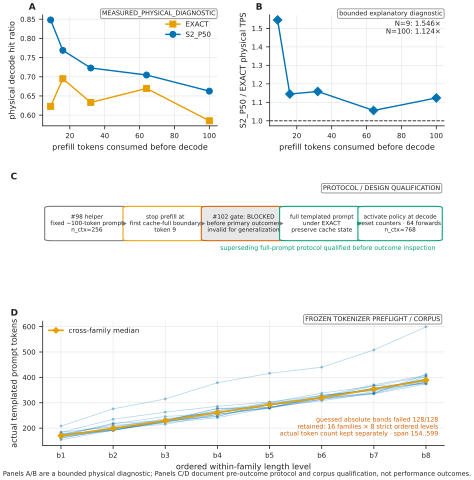

**Figure A2 — Cross-prompt protocol evolution and prefill-depth diagnostic.** Panels A/B retain the bounded `MEASURED_PHYSICAL_DIAGNOSTIC`: physical EXACT/S2_P50 hit ratios and paired TPS ratios at five depths explain why early-first-full and full-prompt absolute results are not pooled; interior points have one process per arm and the path is non-monotonic. Panel C records the pre-outcome `BLOCKED` gate and the superseding full-prompt EXACT-prefill/decode-boundary protocol. Panel D retains all 128 frozen actual token counts: the guessed absolute bands failed 128/128 tokenizer checks, while all 16 families retained strict b1→b8 order over 154..599 tokens. Panels C/D are protocol/corpus qualification, not performance evidence.

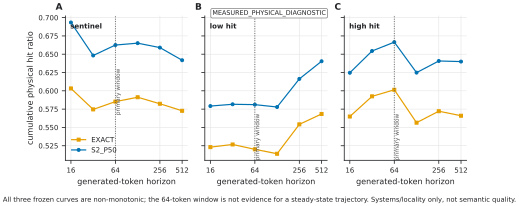

**Figure A3 — Systems/locality horizon diagnostic.** All three prompts retain EXACT/S2_P50 hit ratios at 16–512 tokens, with 64 marked. Every path is non-monotonic. This `MEASURED_PHYSICAL_DIAGNOSTIC` explains why the main window is not steady-state evidence and says nothing about semantic quality.

## Appendix C — Route structure and pinning

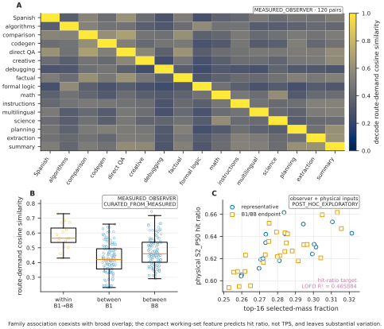

**Figure A1 — Route structure and working-set limits.** Panels A/B retain all `MEASURED_OBSERVER` representative and endpoint comparisons. Panel C joins observer features to `MEASURED_PHYSICAL` hit ratios for 44 prompts and is `POST_HOC_EXPLORATORY`. Its 0.465884 LOFO R² predicts hit ratio, not TPS; family association does not assign expert semantics.

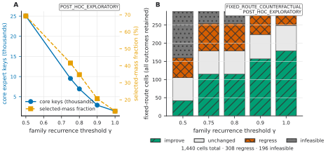

**Figure A5 — Core/periphery and static-pinning limitation.** Panel A is `POST_HOC_EXPLORATORY`; Panel B retains all 1,440 `FIXED_ROUTE_COUNTERFACTUAL` cells, including 308 regressions and 196 infeasible cases. This counterfactual closes static global pinning as the selected same-capacity strategy (`STATIC_PINNING_NOT_SELECTED`). It is not physical pinning, measured RAM saving, or semantic taxonomy; no supported quality interaction was found.

## Appendix D — Capacity and quality

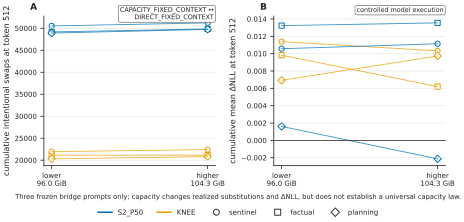

**Figure A4 — Capacity-conditioned perturbation and damage.** All three bridge prompts and both policies retain paired `CAPACITY_FIXED_CONTEXT`/`DIRECT_FIXED_CONTEXT` outcomes at token 512. Capacity changes substitutions and ΔNLL here, but does not establish a universal/monotonic law; ΔNLL is not task accuracy.

## Appendix E — Scope

No accepted local task-level or cross-model result is included; predictive metrics are not converted into task accuracy and claims remain K3-specific.

## Appendix F — Prior-art comparability

| Work | Same model? | Same physical regime? | Raw TPS comparable? | Relevance |
|---|---|---|---|---|
| WASTE | K3 | Different | generally no | streamed systems baseline |
| Colibrì | K3 | Different | generally no | layout/execution baseline |
| FreeToken | no | RAM-resident | no | exact-routing systems baseline |
| Cache-Conditional Experts | other MoEs | different | no | cache-aware routing |
| MoE-ERAS | other MoEs | different | no | residency-aware routing |
| ReMoE | other MoEs | different | no | training-based locality |
