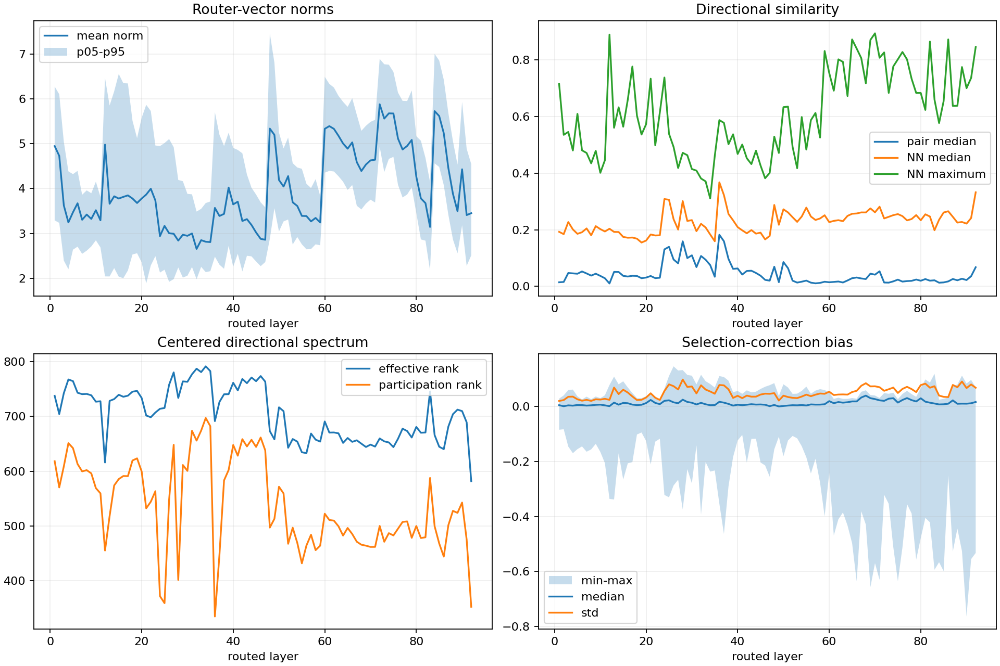
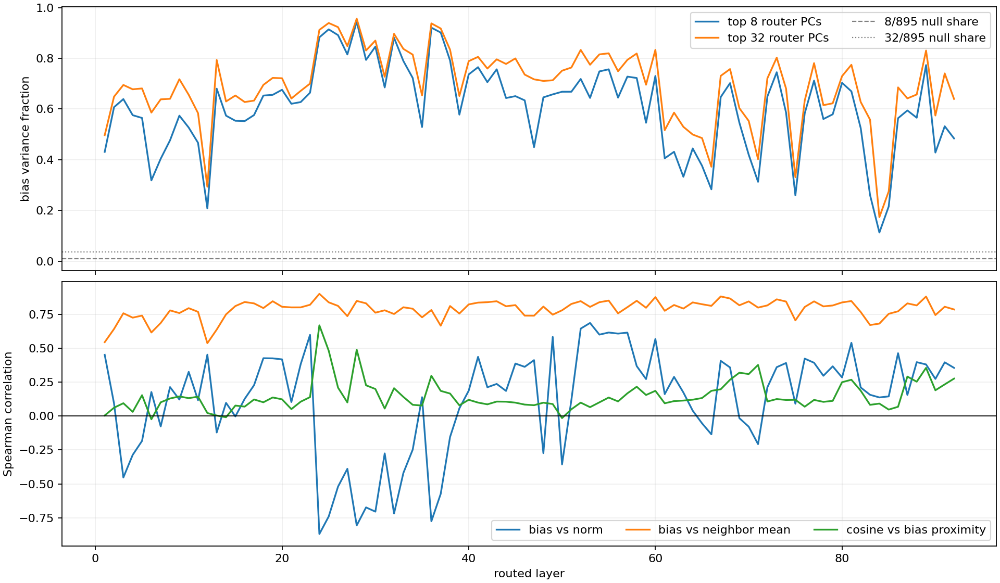
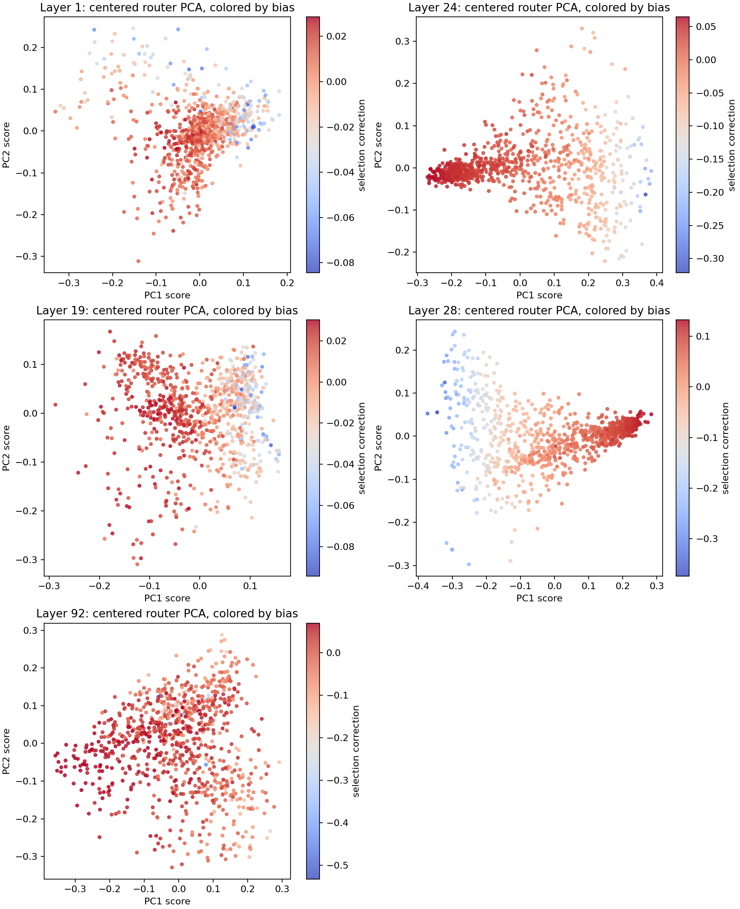
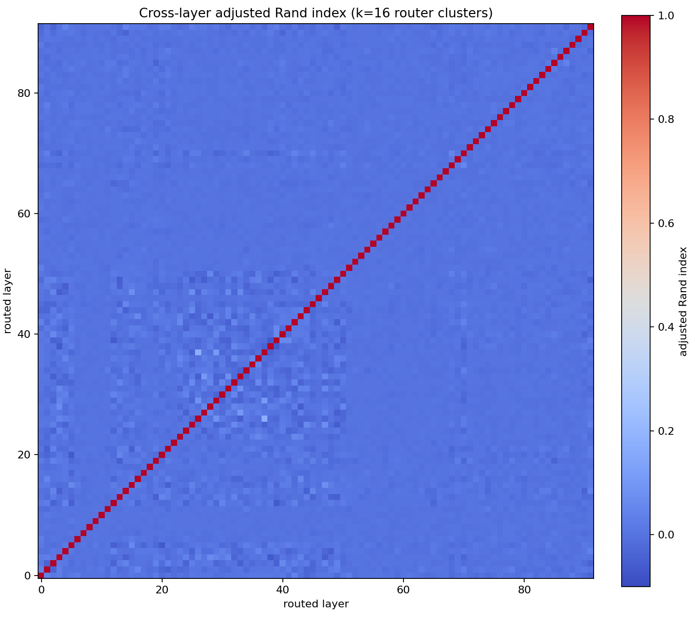

# Kimi K3 static router geometry

## Result

`OBSERVED`: the 92 Kimi K3 routed layers contain meaningful **within-layer**
directional and correction-bias structure, but same-ID cluster memberships and
expert rankings do not persist across layers. Aggregate geometry does recur as a
coarse depth regime, most clearly in layers 24-37. The strongest result is that
the learned selection-correction vectors are highly aligned with low-dimensional
router geometry: the leading 8 centered router principal components explain a
median 63.9% of correction-bias variance, and the leading 32 explain a median
71.2% (versus dimensional null shares of 0.89% and 3.58%).

This is enough to justify a targeted dynamic measurement of a few contrasting
layers. It is **not** evidence for a cache policy, expert frequency, locality,
interchangeability, or a routing change.

## Immutable input and verification

The analysis consumed `kimi-k3-router-pack-v1` for
`moonshotai/Kimi-K3@9f62e4e9fffbd0a83ddd60e1c209d828994b3569`:

- qualified source-artifact manifest SHA-256:
  `58b14d13a602944e1134fc753b2cc819a84a31290aee9c1479264a66dbb5efe2`;
- release tag: `issue75-kimi-k3-router-pack-v1`;
- asset 31 SHA-256:
  `361ec0e256d84a1c931196c08b6996e0e5315e0d2e48bf3041f26d69a5ef62e9`;
- asset 32 SHA-256:
  `f1d767de74060a905b9f63e839766852197841fdd1a249ac5e1a7f9e493a348a`;
- asset 33 SHA-256:
  `442a079d2e6e14a7ef5c9b6c2f53f7300860338cbf4fae7b0d53fa9f3b68ba3c`;
- verified payload: 184/184 tensors, 92 F32 `[7168, 896]` router
  projections, 92 F32 `[896]` correction vectors, 2,363,820,032 bytes.

The immutable pack verifier completed release-size/SHA, archive-member, exact
inventory, and all per-tensor size/SHA checks on this host. Its final bounded
smoke operation then encountered `zip(strict=...)`, which requires Python 3.10+
while this host provides Python 3.9.25. The analysis tool does not alter that
pinned verifier; it is Python-3.9-compatible, repeats exact inventory and all
per-tensor payload validation, rejects non-finite or zero-norm vectors, and then
fully consumes every validated tensor. The pack's previously committed
download-back verification remains unchanged.

## Method

For each layer, the analysis performs:

1. exact norms for all 896 router vectors;
2. the complete 896 x 896 cosine Gram matrix (no sampling or projection);
3. nearest-neighbor and thresholded similar-pair summaries;
4. exact eigendecomposition of the centered cosine Gram matrix;
5. average-linkage clustering on exact cosine distance and exact silhouette
   scores for `k = 2, 4, 8, 16, 32`;
6. correction-bias distributions, robust outliers, and association with norm,
   centroid position, nearest-neighbor bias, pairwise bias proximity, and the
   leading router PCs;
7. adjacent- and all-layer recurrence of expert-ID neighborhoods, `k=16`
   clusters, norm ranks, and correction-bias ranks.

Outliers use an absolute median/MAD robust z-score threshold of 5.0. Cluster
silhouettes and PCA are descriptive; they do not establish functional expert
specialization.

The recorded environment is Python 3.9.25, NumPy 2.0.2, SciPy 1.13.1, and
Matplotlib 3.9.4 on a 16-CPU Linux host. The work is CPU-only and does not use
the full model, inference, runtime traces, or conclusions from issue #77.

## Cross-layer summary

| Metric | Minimum | Median | Maximum |
| --- | ---: | ---: | ---: |
| Mean router-vector norm | 2.654 (L32) | 3.721 | 5.883 (L72) |
| Within-layer norm CV | 0.100 (L72) | 0.157 | 0.397 (L15) |
| Pairwise cosine median | 0.0100 (L12) | 0.0310 | 0.1822 (L36) |
| Nearest-neighbor cosine median | 0.1548 (L19) | 0.2312 | 0.3677 (L36) |
| Strongest pair cosine | 0.3106 (L34) | 0.6012 | 0.8945 (L70) |
| Centered spectral effective rank | 581.9 (L92) | 708.4 | 791.5 (L34) |
| Best cluster silhouette | 0.0070 (L1) | 0.0175 | 0.1585 (L24) |
| Correction-bias standard deviation | 0.0203 (L1) | 0.0470 | 0.0982 (L28) |
| Bias variance in top 32 router PCs | 0.173 (L84) | 0.712 | 0.956 (L28) |

The complete per-layer values are in `per-layer.csv`; bounded expert IDs,
highest-similarity pairs, and robust outliers are in `per-layer.json` and
`expert-outliers.csv`.



## Router-vector geometry

`OBSERVED`:

- Directional geometry varies materially by depth. Pairwise median cosine spans
  0.0100 to 0.1822, median nearest-neighbor cosine spans 0.1548 to 0.3677,
  and centered effective rank spans 581.9 to 791.5 out of a maximum 895.
- Across all 36,888,320 within-layer expert pairs, 259,189 (0.703%) have cosine
  at least 0.3, 6,007 (0.0163%) at least 0.5, and 83 (0.000225%) at least 0.7.
  No pair reaches 0.9.
- The strongest pair is layer 70 experts 44 and 791 at cosine 0.8945. Layer 12
  has the densest very-high-similarity pocket: 23 of the 83 pairs at or above
  0.7. These are localized near-redundant directions, not duplicate vectors.
- Broad cluster separation is weak in most layers: median best silhouette is
  0.0175. Only 12/92 layers reach 0.05 and only layers 24, 25, 28, 36, and 37
  reach 0.10; all five prefer the coarse `k=2` partition. Layer 24 is strongest
  at 0.1585, still well below a cleanly separated clustering.
- Norms contain real local outliers. The global range is 0.9904 (layer 12,
  expert 533) to 9.5875 (layer 48, expert 303), and 45 expert/layer entries cross
  the robust norm-outlier threshold.

`HYPOTHESIS`: layers 24-37 occupy a distinct coarse geometric regime, while
later layers more often contain isolated near-collinear pairs rather than clean
global clusters. This could reflect different router organization by depth, but
static weights cannot identify the hidden states that activate those directions.

## Correction-bias structure

`OBSERVED`:

- Correction terms are strongly asymmetric. The global minimum is -0.7635
  (layer 90, expert 783), while the global maximum is +0.1462 (layer 26,
  expert 492). Later layers generally contain the largest negative tail.
- Geometric neighbors usually have similar corrections. Bias versus mean bias
  of the five nearest router directions has median Spearman correlation 0.805
  (range 0.538-0.902). Nearest-neighbor absolute bias differences are a median
  0.614 times the all-pair difference; only layers 26 and 27 exceed 1.0.
- Pairwise cosine is positively associated with bias proximity in 89/92 layers;
  the median Spearman correlation is 0.119 and the maximum is 0.670 (layer 24).
- The leading router PCs explain far more correction variance than dimensional
  share: median 63.9% for 8 PCs and 71.2% for 32 PCs. In 83/92 layers, the top
  32 PCs explain at least half of correction variance. Layer 28 reaches 95.6%.
- Bias versus router norm does not have a common sign. Its Spearman correlation
  ranges from -0.870 (layer 24) to +0.687 (layer 53). A static claim that the
  correction universally reinforces or counteracts high-norm directions is
  therefore false.

The correction is an input-independent additive selection-score offset, so a
larger value statically favors an expert relative to the same raw sigmoid score
and a smaller value disfavors it. However, whether that offset changes top-16
membership depends on all 896 hidden-state-dependent logits. The observed PC and
neighbor alignment establishes **structure**, not empirical favored frequency.

`HYPOTHESIS`: the correction tensor largely tracks organization already present
in router direction space—especially in layers 24-37—rather than acting as
independent per-expert noise. Whether it reinforces or counterbalances
traffic cannot be resolved without `P(h)` and uncorrected/corrected score margins.





## Recurrence across layers

`OBSERVED`: the within-layer motifs do not map into stable expert-ID families.
The ARI test below is intentionally identity-aligned: it does not rule out a
similar geometric motif recurring under a different permutation of expert IDs.
The aggregate statistics and plots do show a recurring coarse regime across
layers 24-37, without establishing one-to-one expert correspondence.

- Mean all-pair adjusted Rand index for `k=16` partitions is 0.00036; the median
  is effectively zero. The largest pair is only 0.1746 (layers 27 and 38).
- Adjacent-layer mean ARI is 0.00128.
- The same nearest-neighbor ID repeats across adjacent layers 0.00104 of the
  time, slightly below the random-ID reference 1/895 = 0.00112.
- Adjacent top-five neighbor Jaccard is 0.00306 versus a random-set
  approximation of 0.00280.
- Adjacent norm-rank and correction-rank Spearman correlations are 0.00074 and
  0.00085. A few expert indexes enter the top/bottom correction 16 in up to
  seven layers, but the absent adjacent rank continuity and 896-way multiplicity
  do not support a stable identity claim.

The positive mean same-ID direction cosine across adjacent layers (0.0303) is
consistent with shared anisotropy, but it does not come with stable neighborhoods,
clusters, norms, or bias ranks.



## Answers to the controlling questions

1. **Within-layer similarity:** mostly diffuse but anisotropic, with median
   nearest-neighbor cosine 0.231 and strong depth variation.
2. **Clusters/redundancy:** localized near-collinear families exist, especially
   layer 12, but there are no duplicate directions and clean global clusters are
   absent. Layers 24-37 show the clearest coarse two-way structure.
3. **Variation across 92 layers:** substantial in norms, centroid strength,
   pairwise similarity, effective rank, and correction scale; exact ranges are
   tabulated above.
4. **Correction size/structure:** correction ranges from -0.7635 to +0.1462,
   grows a strong negative tail in later layers, and is tightly organized by
   router PCs and neighborhoods.
5. **Reinforce or counteract:** no universal static direction. Norm association
   changes sign; geometric alignment is strong, but top-k effects require logits
   from real hidden states.
6. **Outliers:** yes—45 robust norm, 443 nearest-similarity, 1,336 top-eight
   spectral-leverage, and 1,818 correction-bias expert/layer outliers. These are
   enumerated in the bounded CSV rather than interpreted as runtime hot experts.
7. **Follow-up justified:** yes, a narrow dynamic measurement contrasting strong
   and weak static regimes is justified. No implementation phase is justified.
8. **Requires dynamic evidence:** expert frequency, score margins, actual bias
   membership changes, co-selection, specialization, reuse distance, cache
   locality/hit rate, transfer behavior, latency, quality, and interchangeability.

## Recommended follow-up

`SPECULATIVE`: in a separate approved issue, collect unchanged-runtime router
logits/selected IDs for representative high-structure layers 24, 28, and 36,
localized-pair layers 12 and 70, and controls 19, 34, and 84. Pre-register these
tests:

- whether static clusters concentrate empirical selection mass;
- whether geometrically close pairs have correlated logits, co-selection, or
  substitution under real hidden states;
- how often correction bias changes top-16 membership and at what score margins;
- whether correction-aligned PC cohorts predict any route locality after
  controlling for layer and workload.

The first experiment should recompute corrected/uncorrected membership offline
from captured logits, leaving runtime routing unchanged. Only trace evidence—not
this report—could justify evaluating a static cohort as a cache or prefetch hint.

## Reproduction and artifacts

Install the bounded CPU requirements:

```bash
python3 -m pip install -r scripts/issue75/analysis-requirements.txt
```

Use Python 3.10+ with the immutable pack verifier to download, verify, and
extract the release, then run:

```bash
python3 scripts/issue75/analyze_router_geometry.py \
  --manifest results/2026-08-10/issue75-router-pack/manifest.json \
  --inventory results/2026-08-10/issue75-router-pack/tensors.json \
  --config results/2026-08-10/issue75-router-pack/extraction-config.json \
  --payload-root <verified-extracted-pack> \
  --output-dir <new-empty-output-dir>
```

Bounded outputs:

- `analysis-summary.json`: input identity, methods, aggregate findings, and
  cross-layer recurrence;
- `per-layer.csv` / `per-layer.json`: full per-layer statistics and bounded
  expert-level highlights;
- `adjacent-layers.csv`: consecutive-layer recurrence statistics;
- `expert-outliers.csv`: robust expert/layer outliers;
- `figures/router-geometry-overview.png`: norm, cosine, spectrum, and bias trends;
- `figures/bias-geometry-relationships.png`: correction/router association;
- `figures/cluster-recurrence-k16.png`: all-layer cluster recurrence;
- `figures/representative-router-pca.png`: representative PCA/bias views.

No router matrices, model weights, runtime traces, or large derived pairwise
matrices are committed.
